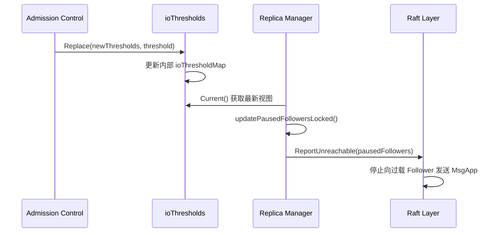

# Deep Dive: `ioThresholdMap` in CockroachDB's Raft Overload Control

## 一、整体职责与设计动机（Why）

### 1.1 背景与问题

在分布式数据库中，Raft 复制是确保数据一致性和高可用性的核心机制。然而，当存储节点（Store）面临 I/O 过载时，持续的复制流量会进一步恶化性能，导致：

- 复制延迟增加
- 请求超时
- 甚至级联故障

CockroachDB 的 `ioThresholdMap` 机制旨在解决这个问题，通过**动态暂停**到过载节点的复制流量，在保证多数派（quorum）可用的前提下，减轻 I/O 压力。

### 1.2 系统位置

`ioThresholdMap` 属于 **KV 层**的 **Raft 复制子系统**，具体位于：
- **模块路径**：`pkg/kv/kvserver/replica_raft_overload.go`
- **协作模块**：
  - **Admission Control**：提供 I/O 负载指标（`admissionpb.IOThreshold`）
  - **Raft 层**：提供复制进度跟踪（`tracker.Progress`）
  - **Replica 管理**：决定哪些 Follower 可以被暂停

### 1.3 核心对象

| 对象 | 类型 | 职责 |
|------|------|------|
| `ioThresholdMap` | 结构体 | 存储 Store 的 I/O 负载阈值，判断是否过载 |
| `ioThresholds` | 封装器 | 线程安全地管理 `ioThresholdMap` 的更新 |
| `ioThresholdMapI` | 接口 | 抽象过载检测能力（`AbovePauseThreshold`） |
| `computeExpendableOverloadedFollowersInput` | 输入参数 | 封装暂停 Follower 的决策上下文 |

### 1.4 关键状态

- **`threshold`**：暂停复制的 I/O 阈值（默认 0.3）
- **`seq`**：版本序列号，用于检测过载集合变化
- **`m`**：`StoreID → IOThreshold` 的映射，存储每个 Store 的实时负载

---

## 二、控制流与交互关系（How it flows）

### 2.1 触发时机

`ioThresholdMap` 的更新是**惰性触发**的，由以下事件驱动：

1. **Admission Control 更新**：
   - 当 Store 的 I/O 负载指标变化时，调用 `ioThresholds.Replace()`
   - 例如：`admission.kv.pause_replication_io_threshold` 设置变更

2. **Raft Leader 定期检查**：
   - Leader 通过 `updatePausedFollowersLocked()` 定期重新计算可暂停 Follower
   - 触发频率：与 Raft tick 同步（通常为数百毫秒）

### 2.2 交互流程



### 2.3 关键决策点

1. **过载检测**：
   ```go
   func (osm *ioThresholdMap) AbovePauseThreshold(id roachpb.StoreID) bool {
       sc, _ := osm.m[id].Score()
       return sc > osm.threshold  // 比较实时负载与阈值
   }
   ```

2. **多数派约束**：
   - 通过 `CanMakeProgress()` 确保暂停 Follower 后仍能形成多数派
   - 如果暂停所有过载 Follower 会破坏多数派，则随机移除部分 Follower 直到满足约束

3. **随机化选择**：
   - 使用 `RangeID` 作为随机种子，确保同一 Range 对同一 Store 的决策稳定
   - 避免"抖动"（flapping）：防止频繁切换暂停目标

---

## 三、DFS 深入：关键函数分析

### 3.1 `ioThresholds.Replace()`

**输入**：
- `m`: 新的 `StoreID → IOThreshold` 映射
- `seqThreshold`: 过载阈值（例如 0.3）

**输出**：
- `prev, cur`: 旧/新的 `ioThresholdMap`

**逻辑**：
```go
func (osm *ioThresholds) Replace(m map[roachpb.StoreID]*admissionpb.IOThreshold, seqThreshold float64) {
    // 1. 加锁保护并发更新
    osm.mu.Lock()
    defer osm.mu.Unlock()

    // 2. 创建新视图，继承旧序列号
    next := &ioThresholdMap{
        threshold: seqThreshold,
        seq:       last.seq,  // 继承
        m:         m,
    }

    // 3. 检查过载集合是否变化
    delta := 0
    for id := range last.m {
        if last.AbovePauseThreshold(id) != next.AbovePauseThreshold(id) {
            delta = 1
            break
        }
    }
    // ... 反向检查 next.m

    // 4. 仅在变化时递增序列号
    next.seq += delta
    osm.mu.inner = next
}
```

**不变量**：
- `seq` 仅在过载集合变化时递增
- 更新是原子的（通过 `syncutil.Mutex` 保护）

**并发考虑**：
- 读操作（`Current()`）无锁，因为 `ioThresholdMap` 是不可变的（整体替换）
- 写操作（`Replace()`）需要锁，但持锁时间短

### 3.2 `computeExpendableOverloadedFollowers()`

**输入**：
- `self`: 当前 Replica ID
- `replDescs`: 所有 Follower 描述
- `ioOverloadMap`: 过载检测接口
- `getProgressMap`: 惰性获取 Raft 进度的回调

**输出**：
- `pausable`: 可暂停的 Follower 集合
- `nonLive`: 非活跃 Follower 及原因

**核心逻辑**：
```go
// 1. 筛选过载 Follower
for _, replDesc := range d.replDescs.Descriptors() {
    if !d.ioOverloadMap.AbovePauseThreshold(replDesc.StoreID) {
        continue
    }
    // 分类为 voter/non-voter
    if prs[raftpb.PeerID(replDesc.ReplicaID)].IsLearner {
        liveOverloadedNonVoterCandidates[replDesc.ReplicaID] = struct{}{}
    } else {
        liveOverloadedVoterCandidates[replDesc.ReplicaID] = struct{}{}
    }
}

// 2. 贪心算法 + 多数派约束
for len(liveOverloadedVoterCandidates) > 0 {
    up := d.replDescs.CanMakeProgress(func(replDesc roachpb.ReplicaDescriptor) bool {
        // 过滤非活跃和要暂停的 Follower
        if _, ok := nonLive[rid]; ok { return false }
        if _, ok := liveOverloadedVoterCandidates[rid]; ok { return false }
        // ...
        return true
    })
    if up {
        break  // 找到最大可暂停集合
    }
    // 随机移除一个 voter，重试
    delete(liveOverloadedVoterCandidates, sl[rnd.Intn(len(sl))])
}
```

**分支逻辑**：
- **非活跃 Follower**：通过 `RecentActive`、`IsPaused`、`Match` 索引检查
- **多数派约束**：如果暂停所有过载 Follower 会破坏多数派，则逐步减少暂停数量
- **随机化**：使用 `RangeID` 作为种子，确保决策稳定性

### 3.3 `updatePausedFollowersLocked()`

**触发条件**：
- 仅 Raft Leader 执行
- 当前 Replica 是 LeaseHolder
- Quota Pool 已启用
- 存在过载 Follower

**关键操作**：
```go
// 1. 获取 Raft 进度并更新活跃性
prs := r.mu.internalRaftGroup.Status().Progress
updateRaftProgressFromActivity(ctx, prs, repls.Descriptors(), func(id roachpb.ReplicaID) bool {
    return r.mu.lastUpdateTimes.isFollowerActiveSince(id, now, r.store.cfg.RangeLeaseDuration)
})

// 2. 计算可暂停 Follower
r.mu.pausedFollowers, _ = computeExpendableOverloadedFollowers(ctx, d)

// 3. 通知 Raft 层
for replicaID := range r.mu.pausedFollowers {
    r.mu.internalRaftGroup.ReportUnreachable(raftpb.PeerID(replicaID))
}
```

**并发安全**：
- 通过 `r.mu` 锁保护 `pausedFollowers` 更新
- `ReportUnreachable()` 是 Raft 层的线程安全接口

---

## 四、动态行为分析

### 4.1 CPU/I/O 负载感知

`ioThresholdMap` **不直接**感知 CPU 负载，而是依赖 **Admission Control** 提供的 I/O 指标：

1. **指标来源**：
   - `admissionpb.IOThreshold` 由 Admission Control 计算
   - 基于磁盘 I/O 延迟、队列长度等指标

2. **阈值机制**：
   - 默认阈值：0.3（通过 `pauseReplicationIOThreshold` 配置）
   - 当 `Score() > threshold` 时，Store 被视为过载

### 4.2 惰性调整 vs 定时任务

**为什么采用惰性调整**：
1. **减少开销**：仅在必要时计算（例如 Leader 变更、过载状态变化）
2. **避免抖动**：决策稳定性高（基于 `RangeID` 的随机种子）
3. **响应性**：与 Raft tick 同步，延迟在数百毫秒内

**与定时任务的对比**：
| 维度 | 惰性调整 | 定时任务 |
|------|----------|----------|
| CPU 开销 | 低（仅在变化时） | 高（定期扫描） |
| 响应速度 | 快（与 Raft tick 同步） | 依赖于间隔 |
| 决策稳定性 | 高（基于种子） | 可能抖动 |

### 4.3 资源利用与过载保护的平衡

**过载保护**：
- 通过暂停复制流量，减少过载 Store 的 I/O 压力
- 优先保证多数派可用性

**资源利用**：
- 仅暂停"可支配"（expendable）的 Follower
- 通过随机化，确保所有过载 Store 公平分担负载

---

## 五、具体示例

### 示例 1：CPU 负载较低时的扩张过程

**场景**：
- 集群有 5 个 Store（S1-S5）
- 初始状态：所有 Store 负载正常（Score < 0.3）
- S1 的负载逐渐升高（例如，由于批量写入）

**时间线**：
1. **t=0s**：
   - `ioThresholdMap`: `{S1:0.25, S2:0.1, S3:0.15, ...}`
   - `AbovePauseThreshold(S1)` = false
   - 所有 Follower 正常接收复制流量

2. **t=1s**：
   - S1 负载上升：`Score=0.35`
   - Admission Control 更新 `ioThresholdMap`:
     ```go
     Replace({S1:0.35, S2:0.1, ...}, 0.3)
     ```
   - `seq` 递增（因为 S1 从非过载→过载）

3. **t=1.1s**：
   - Raft Leader 检测到 `ioThresholdMap` 变化
   - 调用 `updatePausedFollowersLocked()`:
     - 发现 S1 过载
     - 计算可暂停 Follower（假设 S1 是某个 Range 的 Follower）
     - 如果暂停 S1 不影响多数派，则将其加入 `pausedFollowers`

4. **t=1.2s**：
   - Raft 层收到 `ReportUnreachable(S1)`
   - 停止向 S1 发送 `MsgApp`，减轻其 I/O 压力

### 示例 2：CPU 负载升高时的收缩过程

**场景**：
- 集群有 3 个 Store（S1-S3）
- 一个 Range 有 3 个 Replica：R1（Leader，S1），R2（S2），R3（S3）
- S2 和 S3 同时过载（Score=0.4）

**时间线**：
1. **t=0s**：
   - `ioThresholdMap`: `{S2:0.4, S3:0.4}`
   - `AbovePauseThreshold(S2)` = true, `AbovePauseThreshold(S3)` = true

2. **t=0.1s**：
   - Leader 调用 `computeExpendableOverloadedFollowers`:
     - 初始候选：`{R2, R3}`（都是 voter）
     - 检查多数派：
       ```go
       CanMakeProgress(仅 R1) = false  // 需要 2/3 多数派
       ```
     - 随机移除一个（例如 R3）
     - 再次检查：`CanMakeProgress(R1 + R2)` = true

3. **t=0.2s**：
   - 决定暂停 R3
   - `pausedFollowers = {R3}`
   - 通知 Raft 层暂停向 R3 发送流量

4. **t=1s**：
   - S2 负载下降（Score=0.25）
   - `ioThresholdMap` 更新，`seq` 递增
   - Leader 重新计算，发现无过载 Follower，清空 `pausedFollowers`

---

## 六、设计取舍与权衡

### 6.1 固定 Slot 数 vs 动态调整

| 方案 | 优点 | 缺点 |
|------|------|------|
| **固定 Slot** | 简单，无决策开销 | 无法应对动态负载变化 |
| **动态调整** | 适应负载波动 | 需要复杂的决策逻辑 |

**CockroachDB 选择动态调整的原因**：
- 云环境中工作负载波动大
- 过载保护比固定配置更灵活

### 6.2 纯定时后台调整 vs 惰性调整

| 方案 | 优点 | 缺点 |
|------|------|------|
| **定时后台** | 规律性强 | CPU 开销高，可能抖动 |
| **惰性调整** | 低开销，稳定 | 依赖触发事件 |

**惰性调整的优势**：
- 仅在必要时计算（例如过载状态变化）
- 与 Raft tick 同步，响应及时

### 6.3 全局集中控制 vs 按 Work Kind 独立控制

`ioThresholdMap` 采用**按 Store 粒度**的控制，而不是全局或按 Work Kind：

- **优点**：
  - 细粒度：每个 Store 独立评估
  - 公平性：通过随机化避免热点
- **缺点**：
  - 需要维护每个 Store 的状态
  - 决策复杂度高（多数派约束）

---

## 七、总结与心智模型

### 7.1 核心思想

`ioThresholdMap` 是 CockroachDB 在 **Raft 复制层面**实现的**过载保护机制**。其核心理念是：

> **"在保证多数派可用的前提下，动态暂停到过载 Store 的复制流量，通过牺牲部分可支配 Follower 的一致性，换取整体集群的稳定性。"**

### 7.2 心智模型

**如果只记住一件事，那就是**：
> `ioThresholdMap` 是一个**动态黑名单**，它根据实时 I/O 负载，决定哪些 Follower 可以被"暂时忽略"，以减轻过载 Store 的压力。这个决策是**惰性的**、**多数派安全的**，并且通过随机化确保公平性。

### 7.3 伪代码

```go
// 伪代码：ioThresholdMap 的核心逻辑
func protectOverloadedStores() {
    for {
        // 1. 监听过载变化
        newThresholds := admissionControl.GetIOThresholds()
        oldMap, newMap := ioThresholds.Replace(newThresholds, 0.3)

        // 2. 如果过载集合变化
        if newMap.Sequence() > oldMap.Sequence() {
            // 3. 每个 Range 的 Leader 重新计算
            for each range {
                if isLeader(range) {
                    pausable := computeExpendableFollowers(
                        range.Replicas(),
                        newMap,
                    )
                    raft.ReportUnreachable(pausable)
                }
            }
        }
    }
}
```

---

## 附录：关键函数一览表

| 函数 | 职责 |
|------|------|
| `ioThresholds.Replace()` | 更新过载视图，管理序列号 |
| `ioThresholdMap.AbovePauseThreshold()` | 检查 Store 是否过载 |
| `computeExpendableOverloadedFollowers()` | 计算可暂停 Follower 集合 |
| `updatePausedFollowersLocked()` | Leader 更新暂停列表 |
| `ReportUnreachable()` | 通知 Raft 层暂停复制 |

通过上述分析，我们深入理解了 `ioThresholdMap` 在 CockroachDB 中的作用、设计动机、实现细节以及运行时行为。这一机制是分布式数据库在面对资源过载时，保障稳定性和可用性的关键创新。