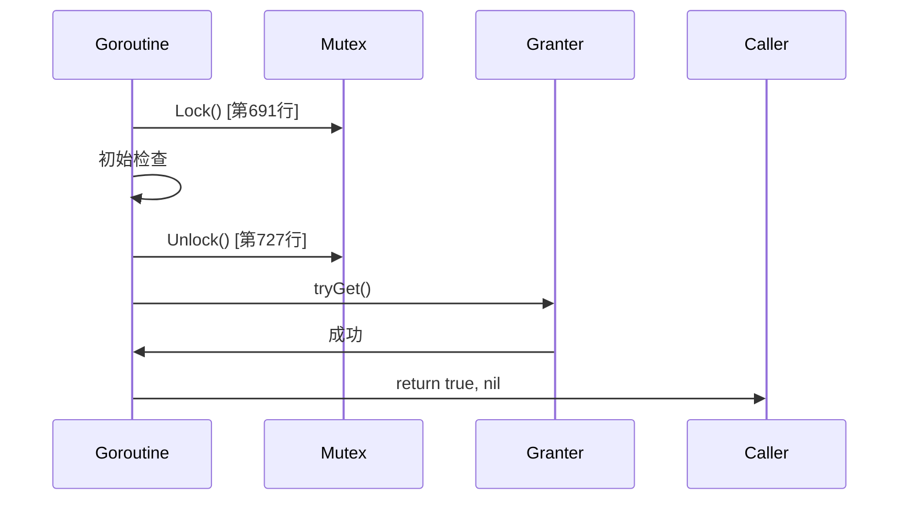
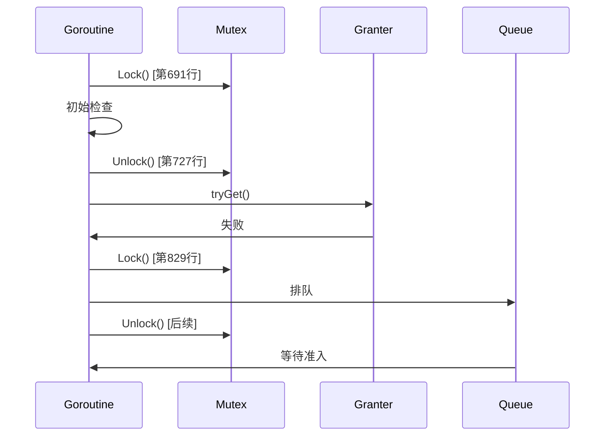
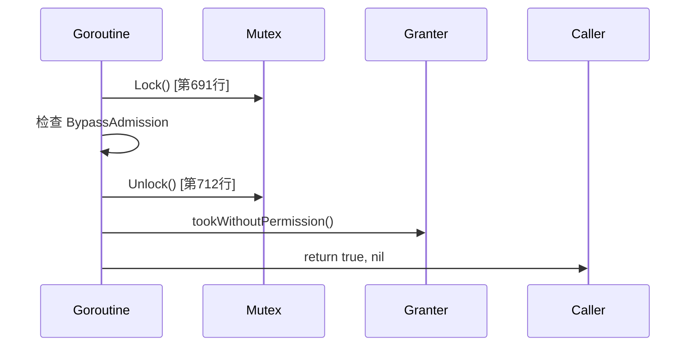

# work_queue.go 锁机制分析

## 问题描述

在 `pkg/util/admission/work_queue.go` 文件中，第691行和第829行都有 `q.mu.Lock()` 调用。初看起来，第691行获取了锁，但在中间没有明确的解锁操作，第829行却能成功再次获取锁。这引发了一个问题：为什么第829行的 `q.mu.Lock()` 可以成功加锁？

## 代码上下文分析

### 第691行上下文

```go
// 第691行
q.mu.Lock()
tenant, ok := q.mu.tenants[tenantID]
if !ok {
    tenant = newTenantInfo(tenantID, q.getTenantWeightLocked(tenantID))
    q.mu.tenants[tenantID] = tenant
}
if info.ReplicatedWorkInfo.Enabled {
    // ... 复制写入检查
}

// 第707行：BypassAdmission 分支
if info.BypassAdmission && q.workKind == KVWork {
    tenant.used += uint64(info.RequestedCount)
    if isInTenantHeap(tenant) {
        q.mu.tenantHeap.fix(tenant)
    }
    q.mu.Unlock()  // ← 在这里解锁
    q.granter.tookWithoutPermission(info.RequestedCount)
    q.metrics.incAdmitted(info.Priority)
    q.metrics.recordBypassedAdmission(info.Priority)
    return true, nil  // ← 直接返回，不再执行后续代码
}

// 第716行：快速路径（Fast Path）
if len(q.mu.tenantHeap) == 0 && !q.knobs.DisableWorkQueueFastPath {
    // ... 快速路径逻辑
    tenant.used += uint64(info.RequestedCount)
    q.mu.Unlock()  // ← 在这里解锁
    
    if q.granter.tryGet(canBurst /*arbitrary*/, info.RequestedCount) {
        // ... 成功获取令牌
        return true, nil  // ← 直接返回
    }
    
    // 第829行：重新获取锁
    q.mu.Lock()
    // ... 继续执行
}
```

## 锁的获取与释放逻辑

### 1. 正常流程

在 `Admit` 函数中，锁的使用遵循以下模式：

1. **第691行**：获取锁 `q.mu.Lock()`
2. **执行初始检查**：检查租户、复制写入等
3. **条件分支**：
   - **BypassAdmission 分支**（第707行）：
     - 执行旁路逻辑
     - **第712行**：解锁 `q.mu.Unlock()`
     - **第715行**：返回 `return true, nil`
   - **快速路径分支**（第716行）：
     - 执行快速路径逻辑
     - **第727行**：解锁 `q.mu.Unlock()`
     - 尝试获取令牌
     - **如果成功**：返回 `return true, nil`
     - **如果失败**：
       - **第829行**：重新获取锁 `q.mu.Lock()`
       - 继续执行排队逻辑

### 2. 锁释放的条件

关键在于理解在什么情况下锁会被释放：

1. **BypassAdmission 分支**：
   - 条件：`info.BypassAdmission && q.workKind == KVWork`
   - 执行：解锁并直接返回
   - 结果：函数提前终止，不会到达第829行

2. **快速路径分支**：
   - 条件：`len(q.mu.tenantHeap) == 0 && !q.knobs.DisableWorkQueueFastPath`
   - 执行：解锁并尝试获取令牌
   - 结果：
     - 如果获取令牌成功：返回，不会到达第829行
     - 如果获取令牌失败：继续执行，到达第829行

## 为什么第829行可以成功加锁

### 1. 锁已经被释放

在第829行执行之前，锁已经在第727行被释放了。这是快速路径分支的设计：

```go
// 快速路径分支
if len(q.mu.tenantHeap) == 0 && !q.knobs.DisableWorkQueueFastPath {
    tenant.used += uint64(info.RequestedCount)
    q.mu.Unlock()  // ← 在这里释放锁
    
    if q.granter.tryGet(canBurst /*arbitrary*/, info.RequestedCount) {
        // 成功：返回
        return true, nil
    }
    
    // 失败：重新获取锁
    q.mu.Lock()  // ← 第829行
    // ... 继续执行
}
```

### 2. 设计意图

这种设计的目的是优化性能：

1. **减少锁持有时间**：在尝试获取令牌时释放锁，允许其他 goroutine 并发执行
2. **快速路径优化**：大多数情况下，令牌获取会成功，可以快速返回
3. **失败时重试**：如果令牌获取失败，重新获取锁并进入排队逻辑

### 3. 竞态条件的处理

代码注释中提到了一个竞态条件：

```go
// 竞态场景：
// T0: 请求A 释放q.mu，调用tryGet()失败
// T1: granter负载降低，调用hasWaitingRequests()
// T2: hasWaitingRequests()返回false（队列还是空的）
// T3: 请求A 重新获取q.mu，准备入队
// T4: 请求A 入队完成
// 结果：granter有空闲容量，但请求A在队列中等待
```

这种设计选择了容忍这种竞态，而不是通过更复杂的同步机制来避免它，因为：

1. **性能优先**：更复杂的同步会增加开销
2. **高频检查**：GrantCoordinator 会高频率检查请求者状态
3. **最终一致性**：虽然可能有短暂的不一致，但最终会达到一致状态

## 锁的完整生命周期

### 1. 成功场景（快速路径）



### 2. 失败场景（需要排队）



### 3. 旁路场景



## 代码中的注释解释

代码中有详细的注释解释锁的使用：

```go
// The code in this method does not use defer to unlock the mutex because it
// needs the flexibility of selectively unlocking on a certain code path.
// When changing the code, be careful in making sure the mutex is properly
// unlocked on all code paths.
```

这段注释强调了：

1. **不使用 defer**：因为需要在不同的代码路径选择性解锁
2. **灵活性**：不同的分支有不同的解锁时间和逻辑
3. **谨慎修改**：修改代码时必须确保所有路径都正确解锁

## 结论

第829行的 `q.mu.Lock()` 可以成功加锁，是因为在第727行锁已经被释放了。这是 CockroachDB 在 `WorkQueue.Admit` 函数中采用的一种优化策略：

1. **减少锁持有时间**：在尝试获取资源时释放锁，提高并发性
2. **快速路径优化**：大多数请求可以快速完成，不需要排队
3. **失败时重试**：只有在资源获取失败时才需要重新获取锁并排队

这种设计虽然引入了潜在的竞态条件，但通过高频率的检查和最终一致性来容忍这些竞态，从而获得更好的整体性能。

## 附录：完整的锁流程示例

```go
func (q *WorkQueue) Admit(ctx context.Context, info WorkInfo) (enabled bool, err error) {
    // 1. 第一次加锁
    q.mu.Lock()  // 第691行
    
    // ... 初始检查
    
    // 2. 旁路分支：解锁并返回
    if info.BypassAdmission && q.workKind == KVWork {
        // ... 处理
        q.mu.Unlock()  // 解锁
        return true, nil  // 返回，不会到达第829行
    }
    
    // 3. 快速路径分支
    if len(q.mu.tenantHeap) == 0 && !q.knobs.DisableWorkQueueFastPath {
        // ... 准备工作
        q.mu.Unlock()  // 第727行：解锁
        
        // 尝试获取令牌
        if q.granter.tryGet(canBurst /*arbitrary*/, info.RequestedCount) {
            // 成功：返回，不会到达第829行
            return true, nil
        }
        
        // 失败：重新加锁
        q.mu.Lock()  // 第829行：可以成功加锁，因为锁已在第727行释放
        
        // 重新检查租户
        tenant, ok = q.mu.tenants[tenantID]
        if !ok {
            tenant = newTenantInfo(tenantID, q.getTenantWeightLocked(tenantID))
            q.mu.tenants[tenantID] = tenant
        }
        
        // 继续排队逻辑...
    }
    
    // ... 其余代码
}
```