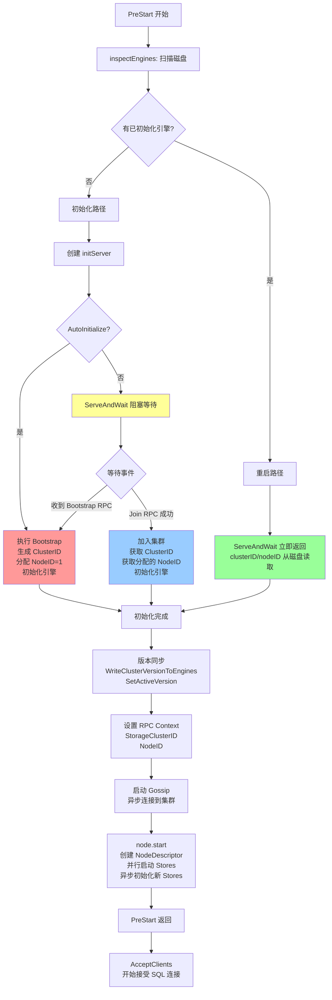
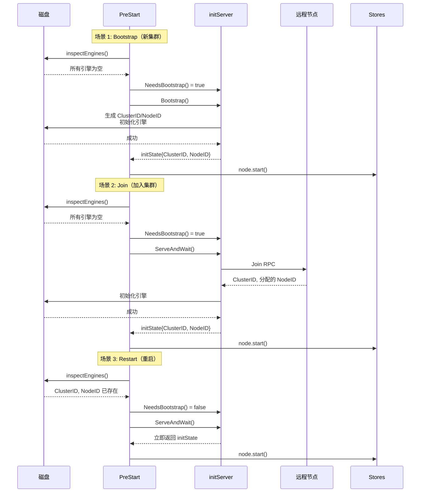
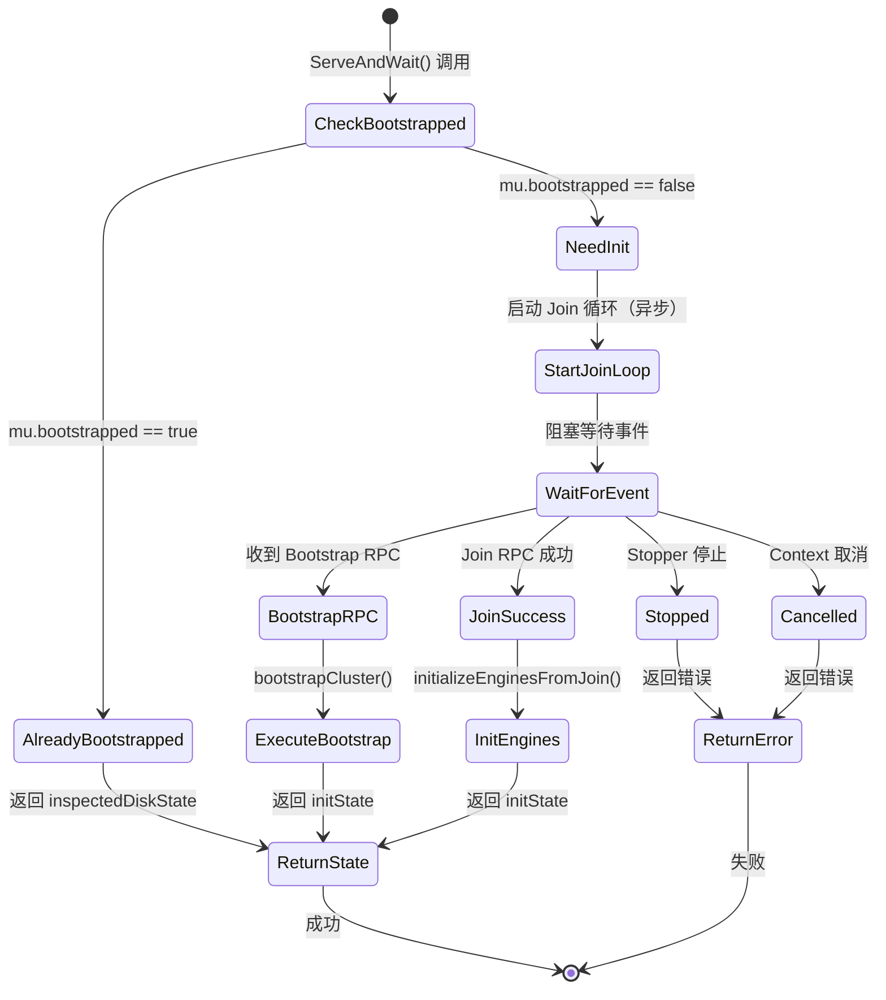
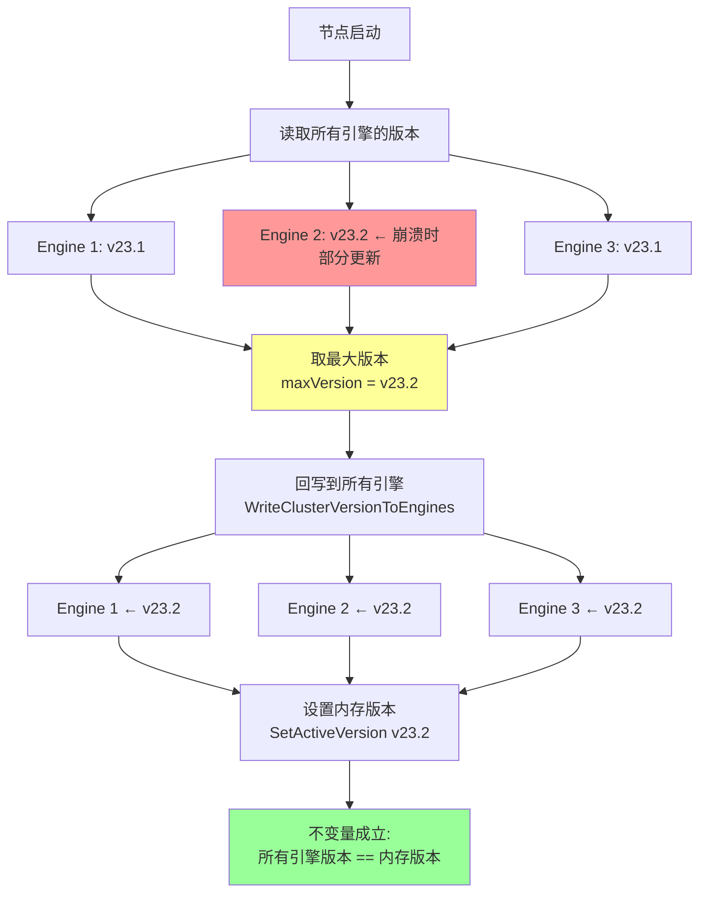
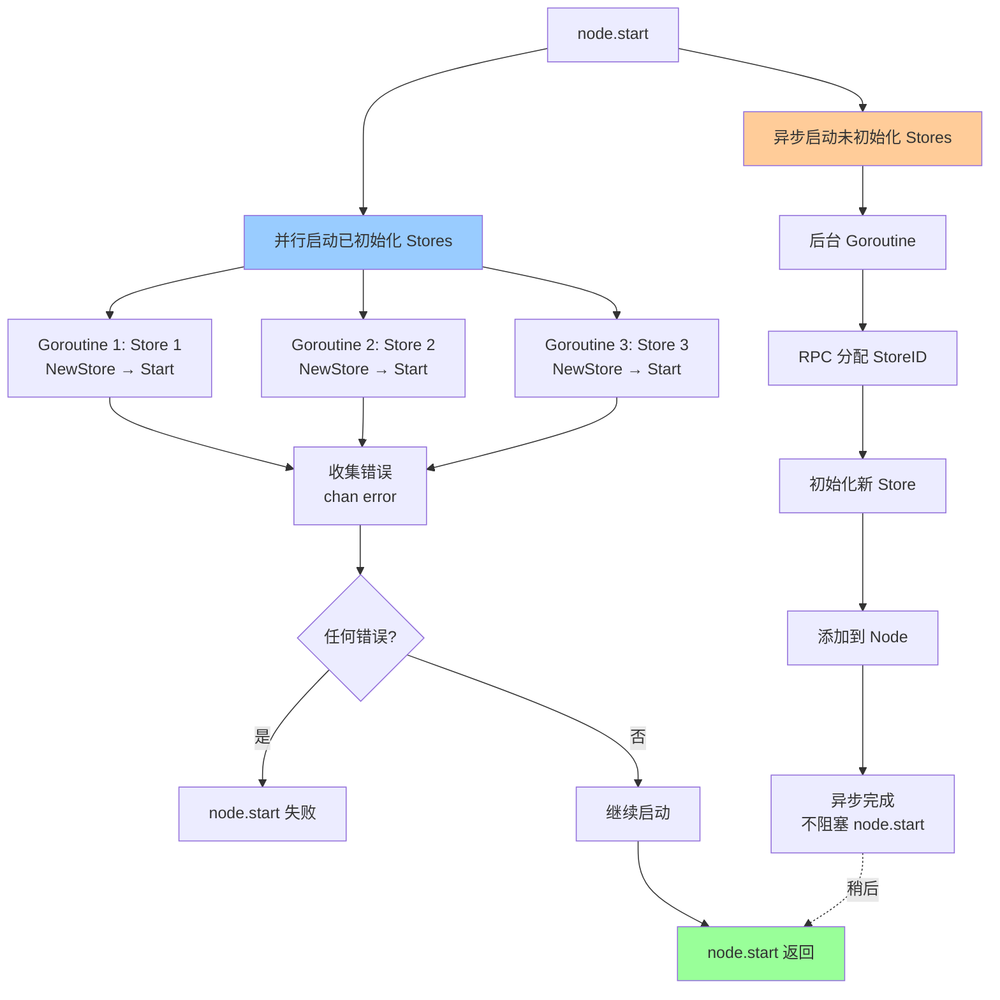

# 第二十章：PreStart 流程——CockroachDB 节点启动前的完整初始化序列

## 核心提示

本章深入分析 CockroachDB 节点在接受客户端连接**之前**必须完成的所有关键初始化步骤。这个阶段被称为 **PreStart**，它决定了节点是创建新集群（bootstrap）、加入现有集群（join）还是重启恢复（restart）。

PreStart 是整个节点启动流程中最复杂的阶段，涉及：
- 磁盘状态检查与版本同步
- 网络监听器初始化（但不接受连接）
- 集群成员身份确认（获取 ClusterID 和 NodeID）
- Gossip 网络建立
- Store 层初始化

理解 PreStart 流程对于排查启动失败、集群初始化问题以及版本升级异常至关重要。

---

## 一、第一轮 BFS：整体职责与设计动机（Why）

### 1.1 PreStart 解决的核心问题

CockroachDB 是一个分布式系统，每个节点启动时面临一个根本性问题：

**"我是谁？我属于哪个集群？"**

这个问题看似简单，但在分布式环境下却异常复杂：

#### 问题 1：身份确认
- 节点需要一个唯一的 **NodeID**（节点标识符）
- 节点需要知道自己所属的 **ClusterID**（集群标识符）
- 这些 ID 必须在整个集群生命周期内保持不变

#### 问题 2：角色判断
节点启动时可能处于三种状态之一：

1. **Bootstrap（引导）**：这是集群中的第一个节点，需要创建新集群
   - 所有存储引擎都是空的
   - 需要生成新的 ClusterID
   - 需要分配 NodeID=1
   - 需要初始化系统表和元数据

2. **Join（加入）**：这是一个新节点，要加入现有集群
   - 所有存储引擎都是空的
   - 需要从现有集群获取 ClusterID
   - 需要从现有集群分配一个新的 NodeID
   - 需要同步集群版本和配置

3. **Restart（重启）**：这是一个已有节点重启
   - 至少有一个存储引擎已经初始化
   - ClusterID 和 NodeID 已经存储在磁盘上
   - 需要验证身份一致性
   - 需要恢复到集群状态

#### 问题 3：版本同步
- 节点的二进制版本（binary version）必须兼容集群的活跃版本（active cluster version）
- 如果节点在停机期间集群进行了版本升级，重启时需要更新本地版本
- 多个存储引擎的版本必须保持一致

#### 问题 4：网络拓扑
- 节点需要监听 RPC、SQL、HTTP 等多个端口
- 但在确认身份之前不能接受外部连接
- 需要支持内部 loopback 连接以完成初始化

### 1.2 PreStart 在系统中的位置

```
Node Startup Lifecycle:
┌─────────────────────────────────────────────────────────────┐
│ 1. NewServer()          │ 创建 Server 对象和依赖组件           │
├─────────────────────────────────────────────────────────────┤
│ 2. PreStart() ◄────────┤ 【本章重点】完成所有初始化            │
│                         │ - 确认 ClusterID/NodeID             │
│                         │ - 初始化 Stores                      │
│                         │ - 建立 Gossip 连接                   │
│                         │ - 但不接受客户端连接                 │
├─────────────────────────────────────────────────────────────┤
│ 3. AcceptClients()      │ 开始接受 SQL 客户端连接              │
├─────────────────────────────────────────────────────────────┤
│ 4. RunServe()           │ 持续运行直到 Shutdown()              │
└─────────────────────────────────────────────────────────────┘
```

PreStart 是 **启动前的守门员**：
- 它必须成功完成，节点才能进入 AcceptClients 阶段
- 它负责建立节点的"合法身份"
- 它确保节点已经准备好参与集群操作（如 Raft 投票）

### 1.3 PreStart 与其他子系统的协作

PreStart 涉及的子系统：

```
PreStart 核心交互图：
┌──────────────────────────────────────────────────────────────┐
│                         PreStart                              │
│                      (pkg/server/server.go)                   │
└────────┬──────────┬──────────┬──────────┬───────────┬────────┘
         │          │          │          │           │
         ▼          ▼          ▼          ▼           ▼
    ┌────────┐ ┌────────┐ ┌────────┐ ┌────────┐ ┌────────────┐
    │Storage │ │  Init  │ │  RPC   │ │ Gossip │ │   Node     │
    │Engines │ │ Server │ │Listener│ │Network │ │  (Stores)  │
    └────────┘ └────────┘ └────────┘ └────────┘ └────────────┘
        │          │          │          │           │
        │          │          │          │           │
    检查磁盘   决定bootstrap  创建监听器  加入网络   启动stores
    状态和版本  还是join      但不accept  等待连接   并验证ID
```

**关键协作关系：**

1. **Storage Engines**（存储引擎）
   - PreStart 调用 `inspectEngines()` 扫描所有磁盘
   - 读取 StoreIdent（包含 ClusterID、NodeID、StoreID）
   - 读取 ClusterVersion 和缓存的 Settings

2. **Init Server**（初始化服务器）
   - 决定是否需要 bootstrap
   - 处理 `cockroach init` 命令
   - 执行 Join RPC 连接到现有集群
   - 返回最终的 initState（包含 ClusterID、NodeID）

3. **RPC Listener**（RPC 监听器）
   - 创建网络监听器（TCP socket）
   - 设置 cmux 多路复用器（gRPC、DRPC、pgwire）
   - 但不调用 `Accept()` 接受连接
   - 等待 initServer 确认身份后才开始服务

4. **Gossip Network**（Gossip 网络）
   - 使用 `--join` 参数指定的地址
   - 异步尝试连接到集群中的其他节点
   - 同步节点描述符和集群元数据

5. **Node & Stores**（节点和存储层）
   - 并行初始化所有已有的 stores
   - 验证所有 stores 的 ClusterID/NodeID 一致
   - 异步初始化新增的空 stores

### 1.4 核心对象与状态

PreStart 阶段的关键数据结构：

#### 1.4.1 `initServer` 结构体
```go
type initServer struct {
    inspectedDiskState *initState  // 磁盘扫描结果
    bootstrapReqCh     chan *initState  // Bootstrap 请求通道
    mu struct {
        bootstrapped bool  // 是否已经 bootstrap
        rejectErr    error // 拒绝 bootstrap 的错误
    }
}
```

**职责：**
- 封装 bootstrap vs join 的决策逻辑
- 提供 `ServeAndWait()` 阻塞直到身份确认
- 实现 Bootstrap RPC 和 Join RPC

#### 1.4.2 `initState` 结构体
```go
type initState struct {
    nodeID               roachpb.NodeID         // 节点 ID
    clusterID            uuid.UUID              // 集群 ID
    clusterVersion       clusterversion.ClusterVersion  // 集群版本
    initializedEngines   []storage.Engine       // 已初始化的引擎
    uninitializedEngines []storage.Engine       // 未初始化的引擎
    initialSettingsKVs   []roachpb.KeyValue     // 缓存的系统设置
    initType             serverpb.InitType      // 初始化类型
}
```

**生命周期：**
1. `inspectEngines()` 创建初始的 initState（从磁盘读取）
2. `initServer.ServeAndWait()` 返回最终的 initState（可能更新版本）
3. PreStart 使用 initState 初始化 Node 和 Stores

#### 1.4.3 存储引擎的状态
每个存储引擎（Engine）磁盘上保存：
```
Store Directory:
├── CURRENT              (RocksDB/Pebble 元数据)
├── 000001.sst           (数据文件)
├── cluster-version      (集群版本，由 CockroachDB 写入)
└── store-ident          (StoreIdent 键，包含 ClusterID/NodeID/StoreID)
```

**初始化状态判断：**
- **已初始化**：存在 `store-ident` 键
- **未初始化**：目录为空或没有 `store-ident`

---

## 二、第二轮 BFS：控制流与交互关系（How it flows）

### 2.1 PreStart 的完整时间线

下面是 PreStart 的完整执行序列，按时间顺序排列：

```
T=0ms: PreStart() 开始
│
├─ Phase 1: 早期初始化（Early Initialization）
│  │
│  ├─ Step 1: 证书管理器初始化 (1574-1584行)
│  │  └─ 如果非 insecure 模式，加载 TLS 证书
│  │     注册 SIGHUP 信号处理器用于证书重新加载
│  │
│  ├─ Step 2: 时间监控启动 (1586-1590行)
│  │  └─ 记录服务器启动时间
│  │     启动 forward clock jump 监控（防止时钟倒退）
│  │
│  ├─ Step 3: Loopback RPC 设置 (1592-1600行)
│  │  └─ 将节点自身注册为本地内部服务器
│  │     节点内部 RPC 可以绕过网络栈，直接函数调用
│  │
│  ├─ Step 4: HTTP/UI 服务启动 (1602-1614行)
│  │  └─ 加载 UI TLS 配置
│  │     启动 HTTP 服务器（Admin UI）
│  │
│  └─ Step 5: 过滤 Gossip 地址 (1616-1621行)
│     └─ 从 --join 参数中移除自己的地址
│        避免节点尝试"加入自己"
│
├─ Phase 2: 磁盘状态检查（Disk Inspection）
│  │
│  ├─ Step 6: 扫描所有存储引擎 (1631-1636行)
│  │  └─ 调用 inspectEngines(engines) → inspectedDiskState
│  │     │
│  │     ├─ 对每个 Engine 读取 StoreIdent
│  │     │  - 如果存在：记录 ClusterID、NodeID、StoreID
│  │     │  - 如果不存在：标记为未初始化
│  │     │
│  │     ├─ 读取所有引擎的 ClusterVersion
│  │     │  - 取最大版本作为 diskClusterVersion
│  │     │  - 如果所有引擎都是空的，使用 binaryMinSupportedVersion
│  │     │
│  │     └─ 读取缓存的系统设置（initialSettingsKVs）
│  │
│  ├─ Step 7: 创建 initServer (1641行)
│  │  └─ newInitServer(inspectedDiskState) → initServer
│  │     │
│  │     └─ 如果 inspectedDiskState 有已初始化引擎
│  │        则 initServer.mu.bootstrapped = true
│  │
│  └─ Step 8: 版本回写与同步 (1644-1699行)
│     └─ 关键不变式：所有引擎的版本必须一致
│        │
│        ├─ WriteClusterVersionToEngines(engines, diskClusterVersion)
│        │  └─ 将磁盘上读到的最大版本写入所有引擎
│        │     （修复可能的版本不一致，如节点在升级中途崩溃）
│        │
│        └─ clusterversion.Initialize(diskClusterVersion, &settings.SV)
│           └─ 初始化内存中的 ClusterSettings.Version
│              从此程序逻辑使用此版本判断特性可用性
│
├─ Phase 3: RPC 服务注册（RPC Service Registration）
│  │
│  ├─ Step 9: 注册 Init RPC (1701-1704行)
│  │  └─ RegisterInitServer(grpc.Server, initServer)
│  │     支持 `cockroach init` 命令
│  │
│  ├─ Step 10: 注册 Migration RPC (1706-1712行)
│  │  └─ RegisterMigrationServer(grpc.Server, migrationServer)
│  │     支持集群版本升级
│  │
│  └─ Step 11: 注册 KeyVisualizer RPC (1714-1718行)
│     └─ RegisterKeyVisualizerServer(grpc.Server, keyVisualizerServer)
│
├─ Phase 4: 网络监听器创建（Network Listeners）
│  │
│  ├─ Step 12: 启动 RPC 和 SQL 监听器 (1725-1738行)
│  │  └─ startListenRPCAndSQL() → pgL, loopbackPgL, startRPCServer
│  │     │
│  │     ├─ 创建 TCP 监听器（但不 Accept）
│  │     │  - RPC listener (gRPC/DRPC)
│  │     │  - SQL listener (pgwire)
│  │     │  - Loopback listeners
│  │     │
│  │     ├─ 设置 cmux 多路复用器
│  │     │  └─ 根据协议头区分 gRPC、DRPC、pgwire
│  │     │
│  │     └─ 返回 startRPCServer 闭包函数
│  │        （稍后调用以开启连接接受）
│  │
│  ├─ Step 13: 配置 grpc-gateway (1770-1787行)
│  │  └─ 创建 gwMux 和 gwCtx
│  │     注册各个 RPC 服务到 gateway
│  │     支持 HTTP/JSON API
│  │
│  ├─ Step 14: 注册 /health 接口 (1789-1793行)
│  │  └─ 提前启用 health check
│  │     无需认证，节点未完全启动时也能返回
│  │
│  └─ Step 15: 写入监听器信息文件 (1795-1821行)
│     └─ 在每个存储目录写入文件：
│        - cockroach.listen-addr (RPC 地址)
│        - cockroach.sql-addr (SQL 地址)
│        - cockroach.http-addr (HTTP 地址)
│        用于外部工具发现节点地址
│
├─ Phase 5: 集群初始化决策（Cluster Init Decision）
│  │
│  ├─ Step 16: 检查是否需要自动 Bootstrap (1829-1834行)
│  │  └─ if cfg.AutoInitializeCluster && initServer.NeedsBootstrap():
│  │        initServer.Bootstrap(ctx, &BootstrapRequest{})
│  │     │
│  │     └─ 仅在单节点模式或测试时使用
│  │        生产环境需要手动 `cockroach init`
│  │
│  ├─ Step 17: 启动 RPC 服务器 (1856行)
│  │  └─ startRPCServer(workersCtx)
│  │     │
│  │     └─ 调用之前创建的闭包函数
│  │        监听器开始 Accept() 连接
│  │        但节点还没有 ClusterID/NodeID（如果需要 bootstrap）
│  │
│  └─ Step 18: 等待初始化完成 (1860-1868行) ◄──【关键阻塞点】
│     └─ state, initialStart, err := initServer.ServeAndWait(workersCtx, stopper, &settings.SV)
│        │
│        │  这个函数会阻塞直到以下三种情况之一发生：
│        │
│        ├─ Case 1: 节点已经 bootstrapped（重启场景）
│        │  └─ 立即返回 inspectedDiskState
│        │
│        ├─ Case 2: 收到 Bootstrap RPC（新集群场景）
│        │  └─ 调用 bootstrapCluster(engines)
│        │     ├─ 生成新的 ClusterID
│        │     ├─ 分配 NodeID=1
│        │     ├─ 初始化所有引擎
│        │     ├─ 写入系统表 schema
│        │     ├─ 创建 bootstrap splits
│        │     └─ 返回新的 initState
│        │
│        └─ Case 3: 成功 Join 到现有集群（加入场景）
│           └─ 持续尝试连接 --join 地址
│              使用 Join RPC 获取 ClusterID 和新的 NodeID
│              初始化引擎并写入 StoreIdent
│              返回 initState
│
├─ Phase 6: 后初始化配置（Post-Init Configuration）
│  │
│  ├─ Step 19: 应用缓存的系统设置 (1871-1875行)
│  │  └─ initializeCachedSettings(state.initialSettingsKVs)
│  │     加载磁盘缓存的集群配置
│  │
│  ├─ Step 20: 更新集群版本（如果需要） (1877-1891行)
│  │  └─ if state.clusterVersion != initialDiskClusterVersion:
│  │        WriteClusterVersionToEngines(engines, state.clusterVersion)
│  │        settings.Version.SetActiveVersion(state.clusterVersion)
│  │     │
│  │     └─ 发生在 Join 场景：本地版本低于集群版本
│  │
│  ├─ Step 21: 设置 RPC Context ID (1892-1893行)
│  │  └─ rpcContext.StorageClusterID.Set(state.clusterID)
│  │     rpcContext.NodeID.Set(state.nodeID)
│  │     │
│  │     └─ 此后所有 RPC 请求携带正确的身份信息
│  │
│  ├─ Step 22: 初始化 DistSQL Planner (1895-1902行)
│  │  └─ SetGatewaySQLInstanceID(nodeID)
│  │     ConstructAndSetSpanResolver(nodeID, locality)
│  │     │
│  │     └─ 配置分布式 SQL 执行引擎
│  │
│  ├─ Step 23: 启动 Gossip 网络 (2031-2039行)
│  │  └─ gossip.Start(advertiseAddr, filteredJoinAddrs, rpcContext)
│  │     │
│  │     └─ 异步连接到其他节点
│  │        同步节点描述符和集群元数据
│  │        等待至少一个 gossip 连接成功
│  │
│  └─ Step 24: 启动 Node (2086-2099行)
│     └─ node.start(ctx, state, initialStart, ...)
│        │
│        └─ 见 Phase 7
│
└─ Phase 7: Node 和 Stores 启动（Node & Stores Startup）
   │
   ├─ Step 25: 创建 NodeDescriptor (node.go:657-669行)
   │  └─ NodeDescriptor {
   │        NodeID, Address, SQLAddress, HTTPAddress,
   │        Locality, ClusterName, ServerVersion, StartedAt
   │     }
   │
   ├─ Step 26: Gossip 节点描述符 (node.go:677-680行)
   │  └─ gossip.SetNodeDescriptor(&nodeDescriptor)
   │     使节点可以通过 NodeID 寻址
   │
   ├─ Step 27: 并行启动所有已初始化的 Stores (node.go:690-710行)
   │  └─ for each initializedEngine:
   │        go func() {
   │            store := NewStore(engine, nodeDescriptor)
   │            store.Start(workersCtx, stopper)
   │            addStore(store)
   │        }()
   │     │
   │     └─ 使用 goroutine 并行初始化
   │        每个 store 独立启动 Raft、Replica 等
   │
   ├─ Step 28: 等待所有 Stores 启动完成 (node.go:712-725行)
   │  └─ 收集所有 goroutine 的错误
   │     阻塞直到所有 stores 完成或遇到错误
   │
   ├─ Step 29: 验证 Stores 一致性 (node.go:727-731行)
   │  └─ validateStores(ctx)
   │     │
   │     └─ 确保所有 stores 的 ClusterID 和 NodeID 一致
   │        防止误挂载其他节点的磁盘
   │
   ├─ Step 30: 读取 "Last Up" 时间戳 (node.go:733-748行)
   │  └─ 从所有 stores 读取上次正常运行的时间
   │     取最新的时间戳作为 node.lastUp
   │     用于判断节点是否长时间离线
   │
   ├─ Step 31: 设置 Gossip 持久化存储 (node.go:750-755行)
   │  └─ gossip.SetStorage(node.stores)
   │     Gossip 使用 stores 持久化已知节点地址
   │     重启后可以快速重新连接
   │
   └─ Step 32: 异步初始化新增的空 Stores (node.go:757-785行)
      └─ if len(uninitializedEngines) > 0:
            go initializeAdditionalStores(uninitializedEngines)
         │
         └─ 不阻塞 node 启动
            新 stores 需要通过 RPC 分配 StoreID
            如果阻塞可能导致死锁（分配器本身需要 quorum）

T=end: PreStart() 返回 nil（成功）
```

### 2.2 三种启动场景的差异

#### 场景 1：Bootstrap（创建新集群）

```
事件序列：
1. inspectEngines() → 所有引擎都是空的
   └─ inspectedDiskState.bootstrapped() == false

2. initServer.NeedsBootstrap() → true

3. 如果 cfg.AutoInitializeCluster == true:
      调用 initServer.Bootstrap() → 立即执行
   否则:
      等待外部 `cockroach init` 命令

4. Bootstrap 执行：
   ├─ 生成 ClusterID（新的 UUID）
   ├─ 分配 NodeID = 1（第一个节点）
   ├─ 初始化所有引擎写入 StoreIdent
   ├─ 在第一个引擎写入系统表 schema
   └─ 返回 initState

5. ServeAndWait() 返回
   └─ state.clusterID = 新生成的 UUID
       state.nodeID = 1
       state.initializedEngines = 所有引擎

6. node.start() 启动所有 stores

结果：一个单节点集群已启动
```

#### 场景 2：Join（加入现有集群）

```
事件序列：
1. inspectEngines() → 所有引擎都是空的
   └─ inspectedDiskState.bootstrapped() == false

2. initServer.NeedsBootstrap() → true

3. 没有 AutoInitializeCluster（生产环境）
   └─ 不调用 Bootstrap()

4. ServeAndWait() 执行 Join 循环：
   ├─ 遍历 --join 参数指定的地址
   ├─ 对每个地址调用 Join RPC
   │  └─ 目标节点返回：
   │     - ClusterID
   │     - 分配的新 NodeID（如 42）
   │     - ClusterVersion
   │     - initialSettingsKVs
   │
   └─ 成功后初始化本地引擎
      └─ 写入 StoreIdent(clusterID, nodeID, storeID)
         返回 initState

5. ServeAndWait() 返回
   └─ state.clusterID = 从集群获取
       state.nodeID = 42（新分配）
       state.clusterVersion = 集群当前版本
       state.initializedEngines = 所有引擎

6. 更新本地集群版本（如果不同）
   └─ WriteClusterVersionToEngines()
       SetActiveVersion()

7. node.start() 启动所有 stores

8. Gossip.Start() 连接到集群网络

结果：节点成功加入集群，可以接受 Raft 复制
```

#### 场景 3：Restart（重启恢复）

```
事件序列：
1. inspectEngines() → 至少一个引擎已初始化
   └─ inspectedDiskState.bootstrapped() == true
       inspectedDiskState.clusterID = 从磁盘读取
       inspectedDiskState.nodeID = 从磁盘读取
       inspectedDiskState.clusterVersion = 从磁盘读取

2. initServer.mu.bootstrapped = true（构造函数设置）

3. initServer.NeedsBootstrap() → false

4. ServeAndWait() 直接返回
   └─ 返回 inspectedDiskState（无需等待）

5. node.start() 启动所有已初始化的 stores
   └─ 验证所有 stores 的 ClusterID/NodeID 一致

6. Gossip.Start() 重新连接到集群网络
   └─ 使用持久化的节点地址快速重连

结果：节点恢复到之前的状态，重新加入集群
```

### 2.3 关键触发时机

PreStart 中有几个关键的**触发点**：

#### 触发点 1：`inspectEngines()` 调用时机
- **时机**：PreStart 早期（创建 initServer 之前）
- **目的**：决定是否需要 bootstrap/join
- **影响**：确定整个初始化流程的分支

#### 触发点 2：`startRPCServer()` 调用时机
- **时机**：ServeAndWait() **之前**
- **目的**：允许接收 Bootstrap RPC 和 Join RPC
- **特点**：此时节点可能还没有 ClusterID/NodeID

#### 触发点 3：`ServeAndWait()` 阻塞时机
- **时机**：RPC 服务器已启动，但节点需要 bootstrap/join
- **阻塞条件**：
  - 等待 `cockroach init` 命令（Bootstrap RPC）
  - 或等待 Join RPC 成功
- **解除阻塞**：获得 ClusterID 和 NodeID

#### 触发点 4：`gossip.Start()` 调用时机
- **时机**：ServeAndWait() **之后**，node.start() **之前**
- **目的**：在 stores 启动前建立网络连接
- **异步性**：不等待 gossip 连接成功就继续

#### 触发点 5：`node.start()` 调用时机
- **时机**：PreStart 最后阶段
- **前置条件**：
  - ClusterID/NodeID 已确认
  - Gossip 网络已启动（异步）
  - RPC 服务器已运行
- **效果**：Stores 开始参与 Raft，可以接受写入

---

## 三、DFS 深入：关键函数与核心逻辑（How it works）

### 3.1 `inspectEngines()` 函数

**位置**：`pkg/server/init.go`（约 200 行）

**函数签名**：
```go
func inspectEngines(
    ctx context.Context,
    engines []storage.Engine,
    latestVersion roachpb.Version,
    minSupportedVersion roachpb.Version,
) (*initState, error)
```

**输入**：
- `engines`：所有配置的存储引擎列表
- `latestVersion`：当前二进制的最新版本
- `minSupportedVersion`：当前二进制支持的最小版本

**输出**：
- `initState`：包含磁盘状态的快照

**核心逻辑**：

```go
func inspectEngines(...) (*initState, error) {
    state := &initState{}

    // 1. 遍历所有引擎，分类已初始化 vs 未初始化
    for _, engine := range engines {
        // 读取 StoreIdent 键
        storeIdent, err := kvstorage.ReadStoreIdent(ctx, engine)

        if err == kvstorage.ErrStoreIdentNotFound {
            // 引擎未初始化，记录到 uninitializedEngines
            state.uninitializedEngines = append(state.uninitializedEngines, engine)
            continue
        }

        // 引擎已初始化，记录到 initializedEngines
        state.initializedEngines = append(state.initializedEngines, engine)

        // 2. 验证 ClusterID 一致性
        if state.clusterID == uuid.Nil {
            state.clusterID = storeIdent.ClusterID  // 第一次遇到
        } else if state.clusterID != storeIdent.ClusterID {
            // 错误：不同的引擎属于不同的集群！
            return nil, errors.New("store cluster ID mismatch")
        }

        // 3. 验证 NodeID 一致性
        if state.nodeID == 0 {
            state.nodeID = storeIdent.NodeID  // 第一次遇到
        } else if state.nodeID != storeIdent.NodeID {
            // 错误：不同的引擎属于不同的节点！
            return nil, errors.New("store node ID mismatch")
        }
    }

    // 4. 读取集群版本（取所有引擎的最大值）
    var maxVersion clusterversion.ClusterVersion
    for _, engine := range state.initializedEngines {
        cv, err := kvstorage.SynthesizeClusterVersionFromEngines(ctx, []storage.Engine{engine}, ...)
        if err != nil {
            return nil, err
        }
        if cv.Version.GreaterThan(maxVersion.Version) {
            maxVersion = cv  // 保留最大版本
        }
    }

    // 5. 如果所有引擎都是空的，使用二进制的最小支持版本
    if len(state.initializedEngines) == 0 {
        maxVersion = clusterversion.ClusterVersion{Version: minSupportedVersion}
    }
    state.clusterVersion = maxVersion

    // 6. 读取缓存的系统设置（仅从第一个引擎）
    if len(state.initializedEngines) > 0 {
        firstEngine := state.initializedEngines[0]
        state.initialSettingsKVs, err = kvstorage.LoadClusterSettings(ctx, firstEngine)
        if err != nil {
            log.Warningf(ctx, "failed to load cluster settings: %v", err)
        }
    }

    return state, nil
}
```

**关键不变量（Invariants）**：

1. **ClusterID 一致性**：
   - 如果多个引擎已初始化，它们必须有相同的 ClusterID
   - 违反此不变量说明误挂载了其他集群的磁盘

2. **NodeID 一致性**：
   - 如果多个引擎已初始化，它们必须有相同的 NodeID
   - 违反此不变量说明误挂载了其他节点的磁盘

3. **版本单调性**：
   - 取所有引擎的最大版本作为磁盘版本
   - 这确保了版本只能升级不能降级

**并发考虑**：
- `inspectEngines()` 是串行执行的（PreStart 早期，无并发）
- 读取是只读操作，不修改磁盘状态

### 3.2 `initServer.ServeAndWait()` 函数

**位置**：`pkg/server/init.go`（约 300 行）

**函数签名**：
```go
func (s *initServer) ServeAndWait(
    ctx context.Context,
    stopper *stop.Stopper,
    sv *settings.Values,
) (*initState, bool, error)
```

**输入**：
- `ctx`：上下文
- `stopper`：停止器（用于优雅关闭）
- `sv`：设置值（用于读取 join 地址）

**输出**：
- `*initState`：最终的初始化状态
- `bool`：是否是初次启动（initialStart）
- `error`：错误

**核心逻辑**：

```go
func (s *initServer) ServeAndWait(...) (*initState, bool, error) {
    // 1. 快速路径：节点已经 bootstrapped（重启场景）
    s.mu.Lock()
    if s.mu.bootstrapped {
        state := s.inspectedDiskState
        s.mu.Unlock()
        return state, false /* initialStart */, nil
    }
    s.mu.Unlock()

    // 2. 需要 bootstrap 或 join
    // 启动 Join 循环（异步）
    joinCtx, cancelJoin := context.WithCancel(ctx)
    defer cancelJoin()

    joinResultCh := make(chan *initState, 1)

    // 异步执行 Join 循环
    if err := stopper.RunAsyncTask(joinCtx, "join-loop", func(ctx context.Context) {
        state, err := s.attemptJoinLoop(ctx, sv)
        if err != nil {
            log.Warningf(ctx, "join loop failed: %v", err)
            return
        }
        joinResultCh <- state
    }); err != nil {
        return nil, false, err
    }

    // 3. 阻塞等待 Bootstrap 或 Join 成功
    select {
    case state := <-s.bootstrapReqCh:
        // Case A: 收到 Bootstrap RPC
        cancelJoin()  // 取消 Join 循环
        s.mu.Lock()
        s.mu.bootstrapped = true
        s.mu.Unlock()
        return state, true /* initialStart */, nil

    case state := <-joinResultCh:
        // Case B: Join RPC 成功
        s.mu.Lock()
        s.mu.bootstrapped = true
        s.mu.Unlock()
        return state, true /* initialStart */, nil

    case <-stopper.ShouldQuiesce():
        // Case C: 服务器正在关闭
        return nil, false, errors.New("server stopping")

    case <-ctx.Done():
        // Case D: 上下文取消
        return nil, false, ctx.Err()
    }
}
```

**关键点**：

1. **快速路径优化**：
   - 如果节点已经 bootstrapped（重启场景），立即返回磁盘状态
   - 避免不必要的 Join 尝试

2. **Bootstrap vs Join 竞争**：
   - Bootstrap RPC 和 Join RPC 可以并发发生
   - 使用 `select` 等待第一个成功的结果
   - 一旦有一个成功，取消另一个

3. **阻塞语义**：
   - `ServeAndWait()` 是 PreStart 的关键阻塞点
   - 在获得 ClusterID/NodeID 之前，整个启动流程停在这里

4. **优雅关闭**：
   - 监听 `stopper.ShouldQuiesce()` 和 `ctx.Done()`
   - 确保节点可以在初始化过程中被终止

### 3.3 `initServer.attemptJoinLoop()` 函数

**核心逻辑**：

```go
func (s *initServer) attemptJoinLoop(ctx context.Context, sv *settings.Values) (*initState, error) {
    // 1. 获取 --join 参数指定的地址列表
    joinAddrs := s.config.GetJoinAddresses(sv)
    if len(joinAddrs) == 0 {
        return nil, errors.New("no join addresses configured")
    }

    // 2. 无限循环尝试连接
    ticker := time.NewTicker(5 * time.Second)
    defer ticker.Stop()

    for {
        select {
        case <-ctx.Done():
            return nil, ctx.Err()
        case <-ticker.C:
            // 每 5 秒尝试一次
        }

        // 3. 遍历所有 join 地址
        for _, addr := range joinAddrs {
            // 4. 建立 gRPC 连接
            conn, err := s.config.GRPCDialOptions(ctx, addr)
            if err != nil {
                log.Infof(ctx, "failed to dial %s: %v", addr, err)
                continue
            }

            // 5. 调用 Join RPC
            client := serverpb.NewInitClient(conn)
            req := &serverpb.JoinNodeRequest{
                EngineSpecs: s.config.Stores.Specs,
                BinaryVersion: s.config.Settings.Version.LatestVersion(),
            }

            resp, err := client.JoinNode(ctx, req)
            if err != nil {
                log.Infof(ctx, "join RPC to %s failed: %v", addr, err)
                conn.Close()
                continue
            }

            // 6. Join 成功，初始化本地引擎
            state, err := s.initializeEnginesFromJoin(ctx, resp)
            if err != nil {
                conn.Close()
                return nil, err
            }

            conn.Close()
            return state, nil  // 成功！
        }

        log.Infof(ctx, "no join address succeeded, will retry in 5s")
    }
}
```

**关键点**：

1. **重试机制**：
   - 每 5 秒遍历一次所有 join 地址
   - 直到有一个地址成功或上下文取消

2. **地址轮询**：
   - 不使用随机选择，而是顺序尝试
   - 如果第一个地址失败，尝试下一个

3. **错误容忍**：
   - 单个地址失败不影响其他地址
   - 只有所有地址都失败才等待下一轮

### 3.4 `bootstrapCluster()` 函数

**位置**：`pkg/server/node.go`（约 467-562 行）

**函数签名**：
```go
func bootstrapCluster(
    ctx context.Context,
    engines []storage.Engine,
    initCfg initServerCfg,
) (*initState, error)
```

**核心逻辑**：

```go
func bootstrapCluster(ctx context.Context, engines []storage.Engine, initCfg initServerCfg) (*initState, error) {
    // 1. 验证所有引擎都是空的
    for _, engine := range engines {
        if _, err := kvstorage.ReadStoreIdent(ctx, engine); err != kvstorage.ErrStoreIdentNotFound {
            return nil, errors.New("cannot bootstrap on initialized engine")
        }
    }

    // 2. 生成新的 ClusterID
    clusterID := uuid.MakeV4()

    // 3. 分配 NodeID = 1（第一个节点）
    nodeID := roachpb.NodeID(1)

    // 4. 获取集群版本（使用二进制的最新版本）
    clusterVersion := initCfg.Settings.Version.LatestVersion()

    // 5. 初始化所有引擎
    for i, engine := range engines {
        storeID := roachpb.StoreID(i + 1)  // StoreID 从 1 开始

        // 写入 StoreIdent
        storeIdent := roachpb.StoreIdent{
            ClusterID: clusterID,
            NodeID:    nodeID,
            StoreID:   storeID,
        }
        if err := kvstorage.WriteStoreIdent(ctx, engine, storeIdent); err != nil {
            return nil, err
        }

        // 写入 ClusterVersion
        if err := kvstorage.WriteClusterVersion(ctx, engine, clusterVersion); err != nil {
            return nil, err
        }
    }

    // 6. 仅在第一个引擎上写入系统数据
    firstEngine := engines[0]

    // 6a. 生成初始系统表 schema
    schema := bootstrap.MakeMetadataSchema(keys.SystemSQLCodec, zonepb.DefaultZoneConfigRef())
    initialValues := schema.GetInitialValues()

    // 6b. 创建 bootstrap splits（分割系统 ranges）
    splits := bootstrap.ComputeSplitKeys(clusterVersion)

    // 6c. 写入初始数据
    if err := kvserver.WriteInitialClusterData(
        ctx,
        firstEngine,
        initialValues,
        splits,
        clusterVersion,
        1, /* numStores */
        initCfg.DefaultSystemZoneConfig,
        initCfg.DefaultZoneConfig,
    ); err != nil {
        return nil, err
    }

    // 7. 读取缓存的系统设置
    initialSettingsKVs, err := kvstorage.LoadClusterSettings(ctx, firstEngine)
    if err != nil {
        log.Warningf(ctx, "failed to load cluster settings: %v", err)
    }

    // 8. 返回 initState
    return &initState{
        nodeID:               nodeID,
        clusterID:            clusterID,
        clusterVersion:       clusterVersion,
        initializedEngines:   engines,
        uninitializedEngines: nil,
        initialSettingsKVs:   initialSettingsKVs,
        initType:             serverpb.InitType_BOOTSTRAP,
    }, nil
}
```

**关键点**：

1. **ClusterID 生成**：
   - 使用 UUIDv4 生成随机 ClusterID
   - 这是集群的永久标识符

2. **NodeID 分配**：
   - Bootstrap 节点总是获得 NodeID=1
   - 后续节点通过 Join RPC 获得递增的 NodeID

3. **StoreID 分配**：
   - 本地按顺序分配 StoreID（1, 2, 3, ...）
   - 新增的 stores 通过 RPC 从 sequence generator 获取

4. **系统表初始化**：
   - 仅在第一个引擎上写入
   - 包括所有系统表的 schema（如 system.namespace, system.users 等）
   - 创建初始的 range splits

5. **幂等性**：
   - 如果引擎已经初始化，函数返回错误
   - 防止意外重新 bootstrap

### 3.5 `node.start()` 函数

**位置**：`pkg/server/node.go`（645-794 行）

**核心逻辑**：

```go
func (n *Node) start(ctx context.Context, state initState, ...) error {
    // 1. 创建 NodeDescriptor
    n.Descriptor = roachpb.NodeDescriptor{
        NodeID:      state.nodeID,
        Address:     addr,
        SQLAddress:  sqlAddr,
        HTTPAddress: httpAddr,
        Locality:    locality,
        ClusterName: clusterName,
        ServerVersion: n.storeCfg.Settings.Version.LatestVersion(),
        StartedAt:   n.storeCfg.Clock.Now().WallTime,
    }

    // 2. Gossip 节点描述符
    n.storeCfg.Gossip.NodeID.Set(ctx, n.Descriptor.NodeID)
    if err := n.storeCfg.Gossip.SetNodeDescriptor(&n.Descriptor); err != nil {
        return err
    }

    // 3. 并行启动所有已初始化的 Stores
    engineErrC := make(chan error, len(state.initializedEngines))
    for _, engine := range state.initializedEngines {
        err := n.stopper.RunAsyncTask(ctx, "initialize-stores", func(ctx context.Context) {
            // 创建 Store
            store := kvserver.NewStore(ctx, n.storeCfg, engine, &n.Descriptor)

            // 启动 Store（加载 replicas、启动 Raft）
            if err := store.Start(ctx, n.stopper); err != nil {
                engineErrC <- err
                return
            }

            // 添加到 Node
            n.addStore(ctx, store)
            engineErrC <- nil
        })
        if err != nil {
            return err
        }
    }

    // 4. 等待所有 Stores 启动完成
    for range state.initializedEngines {
        if err := <-engineErrC; err != nil {
            return err
        }
    }

    // 5. 验证所有 Stores 的 ClusterID/NodeID 一致
    if err := n.validateStores(ctx); err != nil {
        return err
    }

    // 6. 读取 "Last Up" 时间戳
    var mostRecentTimestamp hlc.Timestamp
    n.stores.VisitStores(func(s *kvserver.Store) error {
        timestamp, err := s.ReadLastUpTimestamp(ctx)
        if err != nil {
            return err
        }
        if mostRecentTimestamp.Less(timestamp) {
            mostRecentTimestamp = timestamp
        }
        return nil
    })
    n.lastUp = mostRecentTimestamp.WallTime

    // 7. 设置 Gossip 持久化存储
    if err := n.storeCfg.Gossip.SetStorage(n.stores); err != nil {
        return err
    }

    // 8. 异步初始化未初始化的引擎
    if len(state.uninitializedEngines) > 0 {
        n.additionalStoreInitCh = make(chan struct{})
        n.stopper.RunAsyncTask(ctx, "initialize-additional-stores", func(ctx context.Context) {
            n.initializeAdditionalStores(ctx, state.uninitializedEngines)
            close(n.additionalStoreInitCh)
        })
    }

    return nil
}
```

**关键不变量**：

1. **Store 启动顺序**：
   - 已初始化的 stores 并行启动（提高速度）
   - 未初始化的 stores 异步启动（避免死锁）

2. **身份验证**：
   - 所有 stores 必须有相同的 ClusterID 和 NodeID
   - 防止误挂载其他节点的磁盘

3. **Gossip 依赖**：
   - 在 stores 启动之前设置 NodeDescriptor
   - Gossip 需要 stores 作为持久化存储

**并发考虑**：

1. **并行 Store 启动**：
   - 使用 goroutine 并行启动
   - 使用 buffered channel 收集错误
   - 任何一个 store 失败导致整个启动失败

2. **异步新 Store 初始化**：
   - 不阻塞 node.start() 返回
   - 新 stores 需要通过 RPC 分配 StoreID
   - 如果阻塞可能导致死锁（分配器需要 quorum）

---

## 四、动态行为分析（Runtime 行为）

### 4.1 PreStart 的状态机

PreStart 可以看作一个状态机，根据磁盘状态和外部输入在不同状态之间转换：

```
                         ┌─────────────────────────────┐
                         │     INITIAL_STATE           │
                         │   (PreStart 开始)           │
                         └──────────┬──────────────────┘
                                    │
                                    ▼
                         ┌─────────────────────────────┐
                         │   INSPECT_DISK              │
                         │  (inspectEngines)           │
                         └──────────┬──────────────────┘
                                    │
                    ┌───────────────┴───────────────┐
                    │                               │
         有已初始化引擎?                          无已初始化引擎?
                    │                               │
                    ▼                               ▼
        ┌─────────────────────────┐    ┌─────────────────────────┐
        │  RESTART_PATH           │    │  INIT_REQUIRED          │
        │  (重启场景)              │    │  (需要初始化)            │
        └────────┬────────────────┘    └────────┬────────────────┘
                 │                               │
                 │                   ┌───────────┴───────────┐
                 │                   │                       │
                 │          AutoInitialize?              等待外部输入?
                 │                   │                       │
                 │                   ▼                       ▼
                 │       ┌─────────────────────┐ ┌─────────────────────┐
                 │       │  AUTO_BOOTSTRAP     │ │  WAITING_INIT       │
                 │       │  (自动初始化)        │ │  (阻塞等待)          │
                 │       └────────┬────────────┘ └────────┬────────────┘
                 │                │                       │
                 │                ▼               ┌───────┴───────┐
                 │       ┌─────────────────────┐ │               │
                 │       │  BOOTSTRAPPING      │ │   收到          收到
                 │       │  (创建新集群)        │ │ Bootstrap   Join RPC
                 │       └────────┬────────────┘ │   RPC           成功
                 │                │               │               │
                 │                │               ▼               ▼
                 │                │    ┌─────────────────┐ ┌────────────┐
                 │                │    │  BOOTSTRAPPING  │ │  JOINING   │
                 │                │    │  (同左)          │ │  (加入集群) │
                 │                │    └────────┬────────┘ └──────┬─────┘
                 │                │             │                  │
                 │                └─────────────┴──────────────────┘
                 │                              │
                 └──────────────────────────────┤
                                                │
                                                ▼
                                   ┌─────────────────────────┐
                                   │  IDENTITY_CONFIRMED     │
                                   │  (ClusterID/NodeID确认) │
                                   └────────┬────────────────┘
                                            │
                                            ▼
                                   ┌─────────────────────────┐
                                   │  VERSION_SYNC           │
                                   │  (版本同步)              │
                                   └────────┬────────────────┘
                                            │
                                            ▼
                                   ┌─────────────────────────┐
                                   │  GOSSIP_START           │
                                   │  (启动 Gossip)          │
                                   └────────┬────────────────┘
                                            │
                                            ▼
                                   ┌─────────────────────────┐
                                   │  STORES_START           │
                                   │  (启动 Stores)          │
                                   └────────┬────────────────┘
                                            │
                                            ▼
                                   ┌─────────────────────────┐
                                   │  PRESTART_COMPLETE      │
                                   │  (PreStart 完成)        │
                                   └─────────────────────────┘
```

### 4.2 外部信号如何影响 PreStart

#### 信号 1：磁盘状态（Disk State）

**检测方式**：`inspectEngines()` 读取磁盘

**影响决策**：
```
if len(initializedEngines) > 0:
    → RESTART_PATH
    → 立即返回，无需等待
else:
    → INIT_REQUIRED
    → 进入 bootstrap 或 join 流程
```

**关键点**：
- 磁盘状态是最重要的初始信号
- 决定了整个 PreStart 的主要分支

#### 信号 2：`--join` 参数（Join Addresses）

**检测方式**：配置文件或命令行参数

**影响决策**：
```
if len(joinAddrs) > 0:
    → 启动 Join 循环
    → 尝试连接到现有集群
else if AutoInitializeCluster:
    → 自动 Bootstrap
else:
    → 阻塞等待 `cockroach init` 命令
```

**关键点**：
- 生产环境必须提供 `--join` 或手动 `cockroach init`
- 否则节点永远阻塞在 `ServeAndWait()`

#### 信号 3：Bootstrap RPC

**来源**：`cockroach init` 命令

**影响决策**：
```
initServer.Bootstrap(ctx, req) 被调用:
    → 执行 bootstrapCluster()
    → 生成 ClusterID 和 NodeID
    → 初始化所有引擎
    → 写入系统表 schema
    → 通过 bootstrapReqCh 发送 initState
    → ServeAndWait() 返回
```

**关键点**：
- Bootstrap RPC 和 Join RPC 是互斥的
- 第一个成功的会取消另一个

#### 信号 4：Join RPC 响应

**来源**：现有集群节点

**影响决策**：
```
Join RPC 成功返回:
    → 获得 ClusterID 和分配的 NodeID
    → 初始化本地引擎
    → 写入 StoreIdent
    → 通过 joinResultCh 发送 initState
    → ServeAndWait() 返回
```

**关键点**：
- Join RPC 可能失败多次后才成功
- 每 5 秒重试一次

#### 信号 5：集群版本（Cluster Version）

**来源**：磁盘或 Join RPC 响应

**影响决策**：
```
if state.clusterVersion != initialDiskClusterVersion:
    → WriteClusterVersionToEngines(engines, state.clusterVersion)
    → SetActiveVersion(state.clusterVersion)
```

**关键点**：
- 重启后如果集群版本升级，需要更新本地版本
- 版本不兼容会导致节点无法启动

#### 信号 6：Gossip 连接状态

**来源**：Gossip 网络

**影响决策**：
```
gossip.Start(ctx, advAddr, joinAddrs, rpcContext):
    → 异步尝试连接
    → 不阻塞 PreStart
    → 后台持续重试直到成功
```

**关键点**：
- Gossip 连接是异步的
- PreStart 不等待 Gossip 连接成功
- 但 Stores 启动后需要 Gossip 才能正常工作

### 4.3 PreStart 的时序特性

#### 4.3.1 串行阶段（Sequential Phases）

以下操作**必须**串行执行：

```
1. inspectEngines()
   ↓  (必须先知道磁盘状态)
2. 创建 initServer
   ↓  (必须先有 initServer)
3. 版本回写
   ↓  (必须先同步版本)
4. 注册 RPC 服务
   ↓  (必须先注册服务)
5. 启动 RPC 监听器
   ↓  (必须先监听)
6. ServeAndWait()
   ↓  (必须先确认身份)
7. 设置 RPC Context ID
   ↓  (必须先有 ID)
8. 启动 Gossip
   ↓  (必须先有身份)
9. node.start()
   ↓  (必须最后)
10. PreStart 返回
```

**原因**：每个阶段依赖前一个阶段的结果

#### 4.3.2 并发阶段（Concurrent Phases）

以下操作可以**并发**执行：

```
1. 启动多个 Stores（node.start 内部）
   ├─ Store 1: NewStore() → Start()
   ├─ Store 2: NewStore() → Start()
   └─ Store 3: NewStore() → Start()

2. Join 循环尝试多个地址（逻辑上可并行，但实际是串行）
   ├─ 尝试地址 A
   ├─ 尝试地址 B
   └─ 尝试地址 C

3. Gossip 连接（异步，不阻塞主流程）
   └─ 后台持续尝试连接

4. 未初始化 Stores 的初始化（异步）
   └─ 后台分配 StoreID 并初始化
```

#### 4.3.3 阻塞点（Blocking Points）

PreStart 有几个关键的阻塞点：

1. **`inspectEngines()` 阻塞**：
   - 读取磁盘，I/O 操作
   - 通常很快（毫秒级）

2. **`ServeAndWait()` 阻塞**：
   - 等待 Bootstrap 或 Join 成功
   - 可能很长（等待 `cockroach init`）
   - 或很短（重启场景立即返回）

3. **`node.start()` Store 启动阻塞**：
   - 等待所有 Stores 启动完成
   - 取决于 Replica 数量和磁盘速度
   - 通常几秒到几十秒

4. **Gossip 不阻塞**：
   - `gossip.Start()` 立即返回
   - 连接是异步的

---

## 五、具体示例（Concrete Examples）

### 示例 1：Bootstrap 新集群（单节点）

**场景**：用户第一次启动 CockroachDB，创建单节点集群

**命令**：
```bash
cockroach start-single-node --insecure --store=/data/node1
```

**参数解释**：
- `--insecure`：不使用 TLS
- `--store=/data/node1`：数据目录（空目录）
- `start-single-node` 隐含 `--auto-initialize-cluster=true`

**执行时间线**：

```
T=0ms: PreStart() 开始
│
├─ T=10ms: inspectEngines(/data/node1)
│  └─ /data/node1 是空目录
│     Result: initializedEngines=[], uninitializedEngines=[engine1]
│
├─ T=20ms: 创建 initServer
│  └─ initServer.mu.bootstrapped = false
│     initServer.NeedsBootstrap() = true
│
├─ T=30ms: 版本回写
│  └─ diskClusterVersion = binaryMinSupportedVersion (如 v23.1)
│     WriteClusterVersionToEngines([engine1], v23.1)
│     Initialize ClusterSettings.Version = v23.1
│
├─ T=40ms: 注册 RPC 服务
│  └─ RegisterInitServer(initServer)
│     RegisterMigrationServer(migrationServer)
│
├─ T=50ms: 启动 RPC 监听器
│  └─ startListenRPCAndSQL() → pgL, startRPCServer
│     创建 TCP 监听器（但不 Accept）
│
├─ T=60ms: 检查自动初始化
│  └─ cfg.AutoInitializeCluster = true
│     initServer.NeedsBootstrap() = true
│     → 调用 initServer.Bootstrap()
│
├─ T=70ms: bootstrapCluster() 执行
│  ├─ 生成 ClusterID = uuid(12345678-abcd-...)
│  ├─ 分配 NodeID = 1
│  ├─ 分配 StoreID = 1
│  ├─ 写入 /data/node1/store-ident:
│  │  └─ {ClusterID: 12345678, NodeID: 1, StoreID: 1}
│  ├─ 写入 /data/node1/cluster-version: v23.1
│  ├─ 生成系统表 schema（100+ 表）
│  ├─ 写入初始数据（meta ranges, system.descriptor, etc.）
│  └─ 返回 initState{nodeID: 1, clusterID: 12345678, ...}
│
├─ T=150ms: startRPCServer() 调用
│  └─ RPC 监听器开始 Accept() 连接
│
├─ T=160ms: ServeAndWait() 调用
│  └─ 快速检查 mu.bootstrapped = false（刚设置完）
│     但 bootstrapReqCh 已经有数据！
│     → 立即返回 initState
│
├─ T=170ms: 设置 RPC Context ID
│  └─ rpcContext.StorageClusterID = 12345678
│     rpcContext.NodeID = 1
│
├─ T=180ms: 启动 Gossip
│  └─ gossip.Start(ctx, "127.0.0.1:26257", [], rpcContext)
│     没有 join 地址，单节点自成网络
│
├─ T=200ms: node.start() 调用
│  ├─ 创建 NodeDescriptor{NodeID: 1, Address: "127.0.0.1:26257", ...}
│  ├─ Gossip NodeDescriptor
│  ├─ 启动 Store 1（并行）：
│  │  └─ NewStore(engine1, NodeDescriptor)
│  │     Store.Start() → 加载 Replicas
│  │     初始状态：0 个 Replicas（新集群）
│  ├─ 等待 Store 1 启动完成（200ms）
│  └─ 验证 Stores：ClusterID=12345678, NodeID=1
│
└─ T=400ms: PreStart 返回 nil（成功）

T=400ms: AcceptClients() 开始
└─ SQL 监听器开始接受客户端连接
```

**关键数值**：
- ClusterID: `12345678-abcd-...`（随机生成）
- NodeID: `1`（第一个节点）
- StoreID: `1`（第一个 store）
- ClusterVersion: `v23.1`（二进制的最小支持版本）
- PreStart 总耗时: `400ms`

**磁盘状态变化**：
```
Before PreStart:
/data/node1/
└─ (empty)

After PreStart:
/data/node1/
├─ CURRENT                      (Pebble 元数据)
├─ 000001.sst                   (系统数据)
├─ store-ident                  (ClusterID=12345678, NodeID=1, StoreID=1)
├─ cluster-version              (v23.1)
├─ cockroach.listen-addr        ("127.0.0.1:26257")
├─ cockroach.sql-addr           ("127.0.0.1:26257")
└─ cockroach.http-addr          ("127.0.0.1:8080")
```

### 示例 2：Join 现有集群（新节点）

**场景**：集群已有 2 个节点，现在添加第 3 个节点

**现有集群状态**：
- Node 1: ClusterID=12345678, NodeID=1, Address=192.168.1.10:26257
- Node 2: ClusterID=12345678, NodeID=2, Address=192.168.1.11:26257
- ClusterVersion: v23.1

**命令**：
```bash
cockroach start --insecure \
  --store=/data/node3 \
  --listen-addr=192.168.1.12:26257 \
  --join=192.168.1.10:26257,192.168.1.11:26257
```

**执行时间线**：

```
T=0ms: PreStart() 开始
│
├─ T=10ms: inspectEngines(/data/node3)
│  └─ /data/node3 是空目录
│     Result: initializedEngines=[], uninitializedEngines=[engine1]
│
├─ T=20ms: 创建 initServer
│  └─ initServer.mu.bootstrapped = false
│     initServer.NeedsBootstrap() = true
│
├─ T=30ms: 版本回写
│  └─ diskClusterVersion = binaryMinSupportedVersion (v23.1)
│
├─ T=40ms: 启动 RPC 监听器
│  └─ 监听 192.168.1.12:26257
│
├─ T=50ms: 检查自动初始化
│  └─ cfg.AutoInitializeCluster = false（生产模式）
│     → 不调用 Bootstrap()
│
├─ T=60ms: startRPCServer() 调用
│  └─ RPC 监听器开始 Accept() 连接
│
├─ T=70ms: ServeAndWait() 调用
│  └─ mu.bootstrapped = false
│     → 启动 Join 循环（异步）
│     → 阻塞等待 bootstrapReqCh 或 joinResultCh
│
├─ T=80ms: Join 循环开始（后台 goroutine）
│  ├─ T=80ms: 尝试地址 192.168.1.10:26257
│  │  ├─ 建立 gRPC 连接 → 成功
│  │  ├─ 调用 JoinNode RPC
│  │  │  Request: {
│  │  │    EngineSpecs: ["/data/node3"],
│  │  │    BinaryVersion: v23.1
│  │  │  }
│  │  └─ 等待响应...
│  │
│  ├─ T=150ms: Node 1 处理 JoinNode RPC
│  │  ├─ 验证 BinaryVersion 兼容（v23.1 == v23.1）✓
│  │  ├─ 分配新的 NodeID = 3（从 sequence generator）
│  │  ├─ 返回响应：
│  │  │  Response: {
│  │  │    ClusterID: 12345678-abcd-...,
│  │  │    NodeID: 3,
│  │  │    ClusterVersion: v23.1,
│  │  │    InitialSettingsKVs: [...],
│  │  │  }
│  │  └─ RPC 成功返回
│  │
│  ├─ T=160ms: Node 3 收到 Join 响应
│  │  ├─ initializeEnginesFromJoin()
│  │  │  ├─ 为 engine1 分配 StoreID = 3（本地分配）
│  │  │  ├─ 写入 /data/node3/store-ident:
│  │  │  │  └─ {ClusterID: 12345678, NodeID: 3, StoreID: 3}
│  │  │  ├─ 写入 /data/node3/cluster-version: v23.1
│  │  │  └─ 返回 initState{nodeID: 3, clusterID: 12345678, ...}
│  │  │
│  │  └─ 通过 joinResultCh 发送 initState
│  │
│  └─ T=170ms: ServeAndWait() 解除阻塞
│     └─ 收到 joinResultCh 的数据
│        返回 initState
│
├─ T=180ms: 设置 RPC Context ID
│  └─ rpcContext.StorageClusterID = 12345678
│     rpcContext.NodeID = 3
│
├─ T=190ms: 启动 Gossip
│  └─ gossip.Start(ctx, "192.168.1.12:26257", [192.168.1.10, 192.168.1.11], rpcContext)
│     异步连接到 Node 1 和 Node 2
│
├─ T=200ms: node.start() 调用
│  ├─ 创建 NodeDescriptor{NodeID: 3, Address: "192.168.1.12:26257", ...}
│  ├─ Gossip NodeDescriptor
│  ├─ 启动 Store 3：
│  │  └─ NewStore(engine1, NodeDescriptor)
│  │     Store.Start() → 加载 Replicas
│  │     初始状态：0 个 Replicas（新 store，还没有分配 range）
│  └─ 等待 Store 3 启动完成（150ms）
│
└─ T=350ms: PreStart 返回 nil（成功）

T=350ms: AcceptClients() 开始

T=500ms: Gossip 连接成功
└─ Node 3 通过 Gossip 学习到集群拓扑
   开始接收 Raft range 分配

T=5000ms: Rebalance 开始
└─ Replica rebalancer 将一些 ranges 迁移到 Node 3
```

**关键数值**：
- ClusterID: `12345678-abcd-...`（从 Node 1 获取）
- NodeID: `3`（由 Node 1 分配）
- StoreID: `3`（本地分配）
- ClusterVersion: `v23.1`（从集群获取）
- PreStart 总耗时: `350ms`
- Join RPC 耗时: `80ms`（网络 + 分配 NodeID）

**网络交互**：
```
Node 3 → Node 1:
  JoinNode RPC {EngineSpecs: ["/data/node3"], BinaryVersion: v23.1}

Node 1 → Node 3:
  JoinNode Response {ClusterID: 12345678, NodeID: 3, ClusterVersion: v23.1}

Node 3 → Node 1, Node 2:
  Gossip 连接（异步）
```

### 示例 3：Restart 重启恢复（已有节点）

**场景**：Node 2 崩溃后重启

**磁盘状态（重启前）**：
```
/data/node2/
├─ store-ident         (ClusterID=12345678, NodeID=2, StoreID=2)
├─ cluster-version     (v23.1)
└─ 000123.sst          (1000 个 Replicas 的数据)
```

**命令**：
```bash
cockroach start --insecure \
  --store=/data/node2 \
  --listen-addr=192.168.1.11:26257 \
  --join=192.168.1.10:26257,192.168.1.12:26257
```

**执行时间线**：

```
T=0ms: PreStart() 开始
│
├─ T=10ms: inspectEngines(/data/node2)
│  ├─ 读取 /data/node2/store-ident → ClusterID=12345678, NodeID=2, StoreID=2
│  ├─ 读取 /data/node2/cluster-version → v23.1
│  └─ Result:
│     initializedEngines=[engine1]
│     uninitializedEngines=[]
│     clusterID=12345678
│     nodeID=2
│     clusterVersion=v23.1
│
├─ T=20ms: 创建 initServer
│  └─ initServer.mu.bootstrapped = true （检测到已初始化引擎）
│     initServer.NeedsBootstrap() = false
│
├─ T=30ms: 版本回写
│  └─ diskClusterVersion = v23.1
│     WriteClusterVersionToEngines([engine1], v23.1)  ← 幂等操作，版本未变
│
├─ T=40ms: 启动 RPC 监听器
│  └─ 监听 192.168.1.11:26257
│
├─ T=50ms: 检查自动初始化
│  └─ initServer.NeedsBootstrap() = false
│     → 跳过 Bootstrap
│
├─ T=60ms: startRPCServer() 调用
│  └─ RPC 监听器开始 Accept() 连接
│
├─ T=70ms: ServeAndWait() 调用
│  └─ mu.bootstrapped = true  ← 快速路径！
│     → 立即返回 inspectedDiskState
│        无需等待 Bootstrap 或 Join
│
├─ T=80ms: 设置 RPC Context ID
│  └─ rpcContext.StorageClusterID = 12345678
│     rpcContext.NodeID = 2
│
├─ T=90ms: 启动 Gossip
│  └─ gossip.Start(ctx, "192.168.1.11:26257", [192.168.1.10, 192.168.1.12], rpcContext)
│     └─ 从磁盘读取缓存的 Gossip 地址
│        快速重新连接到已知节点
│
├─ T=100ms: node.start() 调用
│  ├─ 创建 NodeDescriptor{NodeID: 2, Address: "192.168.1.11:26257", ...}
│  ├─ Gossip NodeDescriptor
│  ├─ 启动 Store 2：
│  │  └─ NewStore(engine1, NodeDescriptor)
│  │     Store.Start() → 加载 Replicas
│  │     │
│  │     ├─ T=150ms: 扫描磁盘，发现 1000 个 Replicas
│  │     ├─ T=200ms: 为每个 Replica 创建 Raft state machine
│  │     ├─ T=500ms: 启动 Raft goroutines
│  │     └─ T=1000ms: 所有 Replicas 加载完成
│  │
│  └─ 等待 Store 2 启动完成（1000ms）
│
└─ T=1100ms: PreStart 返回 nil（成功）

T=1100ms: AcceptClients() 开始

T=1200ms: Gossip 连接成功
└─ Node 2 重新加入集群网络
   其他节点发现 Node 2 重新上线

T=1500ms: Raft 重新选举
└─ Node 2 上的 Replicas 重新参与 Raft quorum
   - 一些 Replicas 成为 Follower
   - 一些 Replicas 可能成为 Leader（如果其他节点之前失去 quorum）

T=2000ms: 完全恢复
└─ Node 2 恢复到正常状态
   可以处理读写请求
```

**关键数值**：
- ClusterID: `12345678-abcd-...`（从磁盘读取）
- NodeID: `2`（从磁盘读取）
- StoreID: `2`（从磁盘读取）
- ClusterVersion: `v23.1`（从磁盘读取）
- PreStart 总耗时: `1100ms`（主要是加载 1000 个 Replicas）
- ServeAndWait 耗时: `<1ms`（快速路径）

**重启优化**：
- 无需 Join RPC（身份已知）
- 无需 Bootstrap（集群已存在）
- 使用缓存的 Gossip 地址快速重连
- 最耗时的是加载 Replicas（O(replica count)）

---

## 六、设计取舍与权衡（Trade-offs）

### 6.1 为什么 ServeAndWait 要阻塞？

**当前设计**：
```go
state, initialStart, err := initServer.ServeAndWait(...)  // 阻塞
// 之后才能继续
```

**替代方案 1：异步初始化**
```go
// 不阻塞，立即返回
state, initialStart := initServer.StartAsync()
// 后续操作检查状态
if !state.IsReady() {
    // 拒绝请求
}
```

**权衡对比**：

| 维度                | 阻塞设计（当前）            | 异步设计（替代）           |
|---------------------|---------------------------|--------------------------|
| **简单性**          | ✅ 代码简单，逻辑清晰      | ❌ 需要状态检查和错误处理 |
| **正确性**          | ✅ 强制身份确认后才启动    | ❌ 容易出现 race condition |
| **启动时间**        | ⚠️ 可能很长（等待 init）  | ✅ 立即返回               |
| **资源利用**        | ❌ 阻塞主线程              | ✅ 不阻塞主线程           |
| **错误处理**        | ✅ 集中处理                | ❌ 分散在多处             |
| **集群一致性**      | ✅ 节点不会在未初始化时参与 Raft | ❌ 可能导致不一致         |

**CockroachDB 选择阻塞设计的原因**：

1. **正确性优先**：
   - 节点在没有 ClusterID/NodeID 时不能参与 Raft
   - 阻塞确保身份确认后才启动 Stores

2. **简化错误处理**：
   - 如果初始化失败，直接返回错误，进程退出
   - 不需要处理"部分初始化"的状态

3. **避免 Race Condition**：
   - 如果异步，需要在多处检查 `IsReady()`
   - 容易遗漏检查导致未初始化节点参与集群操作

4. **启动时间不是关键**：
   - 生产环境中，初始化通常很快（重启场景）
   - 新节点加入时，等待几秒是可接受的

### 6.2 为什么并行启动 Stores？

**当前设计**：
```go
for _, engine := range initializedEngines {
    go func() {
        store := NewStore(engine)
        store.Start()
    }()
}
// 等待所有 goroutine 完成
```

**替代方案：串行启动**
```go
for _, engine := range initializedEngines {
    store := NewStore(engine)
    store.Start()  // 阻塞
}
```

**权衡对比**：

| 维度                | 并行启动（当前）          | 串行启动（替代）         |
|---------------------|--------------------------|------------------------|
| **启动时间**        | ✅ O(max(startup_time))  | ❌ O(sum(startup_time)) |
| **资源消耗**        | ⚠️ 高峰时 CPU/IO 消耗大  | ✅ 均匀分布             |
| **错误隔离**        | ⚠️ 需要 channel 收集错误 | ✅ 简单                 |
| **复杂性**          | ⚠️ 并发代码              | ✅ 简单                 |

**数值示例**：

假设节点有 3 个 stores，每个启动需要 5 秒：

- **并行启动**：总耗时 = max(5s, 5s, 5s) = **5秒**
- **串行启动**：总耗时 = 5s + 5s + 5s = **15秒**

**CockroachDB 选择并行启动的原因**：

1. **减少启动时间**：
   - 生产环境节点可能有 10+ 个 stores
   - 串行启动会导致启动时间过长

2. **Store 独立性**：
   - 每个 Store 是独立的
   - 没有初始化顺序依赖

3. **错误处理**：
   - 使用 buffered channel 收集错误
   - 任何一个 store 失败导致整个启动失败（快速失败）

### 6.3 为什么新 Stores 异步初始化？

**当前设计**：
```go
if len(uninitializedEngines) > 0 {
    go initializeAdditionalStores(uninitializedEngines)  // 异步
}
// node.start() 立即返回
```

**替代方案：同步初始化**
```go
if len(uninitializedEngines) > 0 {
    initializeAdditionalStores(uninitializedEngines)  // 阻塞
}
```

**权衡对比**：

| 维度                | 异步初始化（当前）        | 同步初始化（替代）       |
|---------------------|-------------------------|------------------------|
| **死锁风险**        | ✅ 无死锁                | ❌ 可能死锁             |
| **启动时间**        | ✅ 不阻塞启动            | ❌ 延长启动时间         |
| **复杂性**          | ⚠️ 需要异步状态跟踪     | ✅ 简单                 |
| **可用性**          | ⚠️ 新 stores 延迟可用   | ✅ 立即可用             |

**为什么会死锁？**

新 stores 初始化需要通过 RPC 分配 StoreID：
```
Node 3 (新节点) → RPC → Node 1 (分配 StoreID)
                         ↓
                   需要 Raft quorum
                         ↓
                   需要 Node 2 和 Node 3 的 Stores 已启动
```

如果 Node 3 的 `node.start()` 阻塞在初始化新 stores，但新 stores 需要 RPC 到 Node 1，而 RPC 需要 Node 3 的 RPC 服务器已经启动（在 `node.start()` 之后），这就形成了死锁：

```
Node 3.node.start() 阻塞
  ↓
  等待 initializeAdditionalStores() 完成
  ↓
  等待 RPC 分配 StoreID
  ↓
  等待 Raft quorum
  ↓
  等待 Node 3 的 Stores 启动
  ↓
  等待 node.start() 完成
  ↓
  死锁！
```

**CockroachDB 选择异步初始化的原因**：

1. **避免死锁**：
   - 新 stores 初始化需要 RPC，RPC 需要节点已启动
   - 异步确保节点可以先启动再初始化新 stores

2. **快速恢复**：
   - 已有 stores 可以立即参与 Raft
   - 新 stores 稍后初始化不影响集群可用性

3. **渐进式扩容**：
   - 新增磁盘不阻塞节点启动
   - 新 stores 初始化完成后自动加入

### 6.4 为什么 Gossip 异步启动？

**当前设计**：
```go
gossip.Start(ctx, advAddr, joinAddrs, rpcContext)
// 立即返回，不等待连接成功
node.start()
```

**替代方案：同步 Gossip 连接**
```go
gossip.Start(ctx, advAddr, joinAddrs, rpcContext)
gossip.WaitForConnection()  // 阻塞直到连接成功
node.start()
```

**权衡对比**：

| 维度                | 异步 Gossip（当前）      | 同步 Gossip（替代）      |
|---------------------|-------------------------|------------------------|
| **启动时间**        | ✅ 不阻塞启动            | ❌ 延长启动时间         |
| **故障容忍**        | ✅ 网络问题不阻塞启动    | ❌ 网络问题导致启动失败 |
| **Raft 可用性**     | ⚠️ Gossip 未连接时 Raft 也能工作 | ✅ 确保网络就绪 |
| **复杂性**          | ⚠️ 需要处理未连接状态   | ✅ 简单                 |

**CockroachDB 选择异步 Gossip 的原因**：

1. **Raft 不依赖 Gossip**：
   - Raft 使用直接 RPC，不需要 Gossip
   - Gossip 主要用于发现新节点和传播元数据

2. **故障容忍**：
   - 如果 Gossip 网络暂时不可达，节点仍可启动
   - 后台持续重试连接

3. **快速启动**：
   - 不等待 Gossip 连接可以更快地参与 Raft quorum
   - 对于集群恢复至关重要

### 6.5 为什么版本要回写到所有引擎？

**当前设计**：
```go
WriteClusterVersionToEngines(allEngines, diskClusterVersion)
```

**替代方案：只写初始化的引擎**
```go
WriteClusterVersionToEngines(initializedEngines, diskClusterVersion)
```

**权衡对比**：

| 维度                | 回写所有引擎（当前）      | 只写已初始化引擎（替代） |
|---------------------|-------------------------|------------------------|
| **一致性**          | ✅ 强一致性              | ❌ 可能不一致           |
| **写放大**          | ⚠️ 多余的写操作          | ✅ 最小写入             |
| **崩溃恢复**        | ✅ 健壮                  | ❌ 可能丢失版本更新     |
| **新引擎处理**      | ✅ 新引擎立即有正确版本  | ❌ 新引擎版本滞后       |

**为什么需要强一致性？**

假设节点有 3 个引擎，在升级过程中崩溃：

```
升级前状态：
  Engine 1: v23.1
  Engine 2: v23.1
  Engine 3: v23.1

升级中（v23.1 → v23.2）：
  Engine 1: v23.2 ← 写入成功
  Engine 2: v23.1 ← 尚未写入
  Engine 3: v23.1 ← 尚未写入
  ↓
  【崩溃！】

重启后 inspectEngines()：
  max(v23.2, v23.1, v23.1) = v23.2 ← 取最大版本

回写操作：
  WriteClusterVersionToEngines([Engine 1, Engine 2, Engine 3], v23.2)
  ↓
  所有引擎都是 v23.2 ← 修复不一致
```

**CockroachDB 选择回写所有引擎的原因**：

1. **修复崩溃导致的版本不一致**：
   - 升级过程中崩溃可能导致部分引擎版本更新
   - 回写确保所有引擎版本一致

2. **简化逻辑**：
   - 不需要跟踪哪些引擎已经更新
   - 幂等操作，重复写入无害

3. **处理新引擎**：
   - 新增的空引擎也立即获得正确版本
   - 避免后续初始化时的版本冲突

4. **成本可接受**：
   - 版本更新很少发生（月级别）
   - 写入成本相对较小（单个键值对）

---

## 七、总结与心智模型

### 7.1 PreStart 的核心思想

**一句话总结**：

> PreStart 是节点启动前的**身份确认与资源准备阶段**，它确保节点在接受客户端连接之前已经获得合法的 ClusterID 和 NodeID，并完成所有存储和网络层的初始化。

**核心不变量**：

1. **身份不变量**：
   ```
   PreStart 返回后，节点必须有：
   - 唯一的 NodeID
   - 确定的 ClusterID
   - 至少一个已初始化的 Store
   ```

2. **版本不变量**：
   ```
   所有 Engines 的 ClusterVersion 必须一致
   且等于内存中的 ClusterSettings.Version
   ```

3. **顺序不变量**：
   ```
   ServeAndWait() 必须在 node.start() 之前返回
   node.start() 必须在 AcceptClients() 之前完成
   ```

### 7.2 心智模型："护照办理流程"

可以把 PreStart 类比为**办理护照**的流程：

```
1. 检查身份（inspectEngines）
   └─ 相当于检查是否已经有护照
      - 有护照（重启）：直接跳到第 7 步
      - 无护照（新节点）：继续

2. 准备材料（RPC 服务注册）
   └─ 相当于准备办理护照所需的文件

3. 等待审批（ServeAndWait）
   └─ 相当于等待护照审批通过
      - Bootstrap：自己给自己发护照（单节点模式）
      - Join：向已有护照的人申请（加入集群）

4. 领取护照（获得 ClusterID/NodeID）
   └─ 相当于拿到护照

5. 登记信息（写入磁盘）
   └─ 相当于在护照上写名字和照片

6. 更新版本（版本同步）
   └─ 相当于护照延期或更新

7. 建立联系（Gossip）
   └─ 相当于注册海外通讯录

8. 开始工作（node.start）
   └─ 相当于使用护照开始工作

9. 接待客户（AcceptClients）
   └─ 相当于正式营业
```

### 7.3 简化伪代码

```python
def PreStart():
    # Phase 1: 检查磁盘状态
    disk_state = inspect_engines(engines)

    # Phase 2: 决定初始化路径
    if disk_state.has_initialized_engines():
        # 重启路径：快速恢复
        cluster_id = disk_state.cluster_id
        node_id = disk_state.node_id
        cluster_version = disk_state.cluster_version
        initial_start = False
    else:
        # 初始化路径：需要 bootstrap 或 join
        init_server = create_init_server(disk_state)

        if auto_initialize:
            # 自动创建新集群
            cluster_id, node_id, cluster_version = bootstrap_cluster(engines)
        else:
            # 等待 Bootstrap RPC 或 Join RPC
            cluster_id, node_id, cluster_version = init_server.serve_and_wait()

        initial_start = True

    # Phase 3: 版本同步
    write_cluster_version_to_all_engines(engines, cluster_version)
    set_active_version(cluster_version)

    # Phase 4: 设置身份
    rpc_context.cluster_id = cluster_id
    rpc_context.node_id = node_id

    # Phase 5: 启动 Gossip（异步）
    gossip.start(advertise_addr, join_addrs, rpc_context)

    # Phase 6: 启动 Node 和 Stores
    node.start(cluster_id, node_id, cluster_version, initial_start)
    # 内部逻辑：
    #   - 并行启动所有已初始化的 Stores
    #   - 异步初始化未初始化的 Stores
    #   - 验证所有 Stores 的身份一致性

    return success
```

### 7.4 关键记忆点

**如果只记住三件事，那就是：**

1. **ServeAndWait 是关键阻塞点**：
   - 重启场景：立即返回（快速路径）
   - 新集群场景：等待 Bootstrap RPC
   - 加入场景：等待 Join RPC 成功

2. **版本一致性是硬性要求**：
   - 所有引擎的版本必须一致
   - 通过回写操作修复崩溃导致的不一致

3. **并发启动的权衡**：
   - 已初始化 Stores：并行启动（加速）
   - 未初始化 Stores：异步启动（避免死锁）
   - Gossip 连接：异步进行（不阻塞启动）

---

## 八、Mermaid 图示

### 8.1 PreStart 完整流程图



### 8.2 三种启动场景对比



### 8.3 ServeAndWait 状态机



### 8.4 版本同步机制



### 8.5 Store 启动并发模型



---

## 结语

PreStart 是 CockroachDB 启动流程中最复杂但最关键的阶段。理解 PreStart 的设计哲学——**先确认身份，再参与集群**——对于理解整个系统的启动和恢复机制至关重要。

核心要点回顾：
1. PreStart 通过磁盘状态决定是重启、bootstrap 还是 join
2. ServeAndWait 是关键阻塞点，确保身份确认
3. 版本一致性通过回写操作保证
4. 并发设计在速度和正确性之间取得平衡
5. 异步初始化避免死锁但增加复杂性

掌握这些知识后，你将能够：
- 诊断节点启动失败的根本原因
- 理解集群初始化和节点加入的机制
- 排查版本升级相关的问题
- 优化多 store 节点的启动性能
