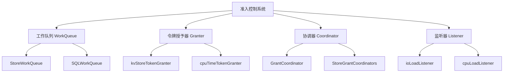
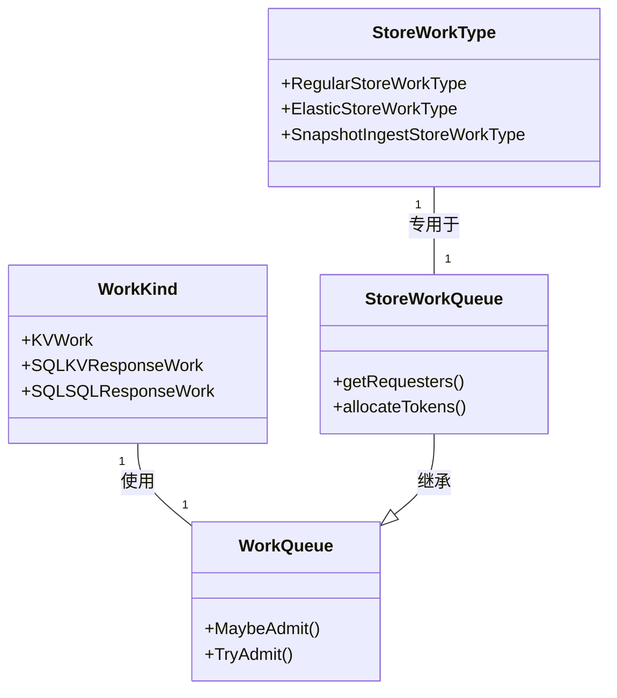
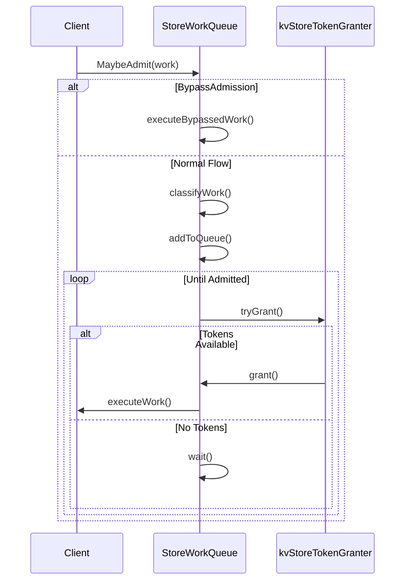

# 第章：CockroachDB 准入控制系统与 StoreWorkType 深度解析

## 引言

在分布式数据库系统中，资源管理和工作调度是确保系统稳定性和性能的关键因素。CockroachDB 的准入控制系统作为其核心组件之一，通过精细的工作分类和动态资源分配机制，实现了高效的资源利用和工作优先级管理。本章将深入探讨 CockroachDB 准入控制系统的设计理念、实现机制，并特别关注 `StoreWorkType` 在这一系统中的核心作用。

## 第一节：准入控制系统概览

### 1.1 准入控制的目标与意义

准入控制（Admission Control）在 CockroachDB 中扮演着资源守门人的角色，其主要目标包括：

1. **防止资源过载**：确保系统在资源饱和情况下仍能维持稳定的性能，避免因过载导致的节点故障或吞吐量急剧下降。

2. **工作优先级区分**：实现不同重要性工作之间的差异化处理，确保关键操作（如用户查询）优先于后台任务（如垃圾回收）执行。

3. **多租户公平性**：在 Serverless 环境中，确保不同租户能够公平地共享系统资源，防止某个租户垄断资源。

4. **动态适应**：根据系统负载的实时变化，动态调整资源分配策略，最大化资源利用率。

### 1.2 系统架构与组件

CockroachDB 的准入控制系统由以下核心组件构成：



### 1.3 工作流程

准入控制系统的典型工作流程如下：

1. **工作提交**：客户端或内部组件提交工作请求
2. **工作分类**：根据工作性质分配 `WorkKind` 和 `StoreWorkType`
3. **队列排序**：工作进入对应的 `WorkQueue` 并根据优先级排序
4. **资源请求**：`WorkQueue` 向 `Granter` 请求资源（令牌或槽位）
5. **资源分配**：`Granter` 根据系统负载和工作优先级决定是否授予资源
6. **工作执行**：获得资源的工作开始执行
7. **资源释放**：工作完成后释放资源，供其他工作使用

## 第二节：工作分类与优先级管理

### 2.1 工作种类（WorkKind）

CockroachDB 将工作分为三大类，每种工作类型有不同的特征和处理方式：

1. **KV 工作（KVWork）**：
   - **定义**：Key-Value 层的批量操作
   - **拦截点**：`roachpb.InternalServer.Batch` API
   - **特征**：具有明确的完成指示器
   - **资源管理**：使用槽位（slots）机制

2. **SQL-KV 响应工作（SQLKVResponseWork）**：
   - **定义**：SQL 层处理来自 KV 层的响应
   - **拦截点**：SQL 层接收到 KV 响应时
   - **特征**：无明确完成指示器
   - **资源管理**：使用令牌（tokens）机制

3. **SQL-SQL 响应工作（SQLSQLResponseWork）**：
   - **定义**：根节点处理来自叶节点的 DistSQL 响应
   - **拦截点**：DistSQL 根节点接收响应时
   - **特征**：无明确完成指示器
   - **资源管理**：使用令牌（tokens）机制

### 2.2 工作优先级（WorkPriority）

CockroachDB 定义了多个优先级等级，从低到高依次为：

```go
// pkg/util/admission/admissionpb/admissionpb.go
const (
    LowPri WorkPriority = math.MinInt8          // 最低优先级
    BulkLowPri = -100                           // 批量操作低优先级
    UserLowPri = -50                            // 用户操作低优先级
    BulkNormalPri = -30                         // 批量操作正常优先级
    NormalPri = 0                               // 正常优先级
    LockingNormalPri = 10                       // 带锁的正常优先级
    UserHighPri = 50                            // 用户操作高优先级
    LockingUserHighPri = 100                    // 带锁的用户高优先级
    HighPri = math.MaxInt8                      // 最高优先级
)
```

### 2.3 工作类别（WorkClass）

根据优先级，工作被分为两大类：

1. **RegularWorkClass**：通吐量和延迟敏感的工作（优先级 ≥ NormalPri）
2. **ElasticWorkClass**：可以处理减少吐吐量的工作（优先级 < NormalPri）

```go
// pkg/util/admission/admissionpb/admissionpb.go
func WorkClassFromPri(pri WorkPriority) WorkClass {
    if pri < NormalPri {
        return ElasticWorkClass
    }
    return RegularWorkClass
}
```

## 第三节：StoreWorkType 深度解析

### 3.1 StoreWorkType 的定义与分类

`StoreWorkType` 是存储层工作的专门分类，用于更细粒度的 IO 资源管理。它定义了三种存储工作类型：

```go
// pkg/util/admission/admissionpb/admissionpb.go
type StoreWorkType int8

const (
    RegularStoreWorkType StoreWorkType = iota      // 常规存储工作
    SnapshotIngestStoreWorkType = 1                // 快照摄入工作
    ElasticStoreWorkType = 2                       // 弹性存储工作
    NumStoreWorkTypes = 3                          // 工作类型总数
)
```

### 3.2 StoreWorkType 与 WorkClass 的映射

```go
// pkg/util/admission/admissionpb/admissionpb.go
func WorkClassFromStoreWorkType(workType StoreWorkType) WorkClass {
    switch workType {
    case RegularStoreWorkType:
        return RegularWorkClass
    case ElasticStoreWorkType:
        return ElasticWorkClass
    case SnapshotIngestStoreWorkType:
        return ElasticWorkClass  // 注意：虽然是 Elastic，但有特殊处理
    }
    return RegularWorkClass
}
```

### 3.3 StoreWorkType 的具体特征

| StoreWorkType | 对应 WorkClass | 优先级 | 令牌要求 | 用例 |
|---------------|----------------|--------|----------|------|
| RegularStoreWorkType | RegularWorkClass | 高 | Regular IO 令牌 | 用户查询、事务处理 |
| ElasticStoreWorkType | ElasticWorkClass | 中 | 磁盘+Regular IO+Elastic IO 令牌 | 批量操作、后台任务、索引构建 |
| SnapshotIngestStoreWorkType | ElasticWorkClass | 高 | 磁盘写令牌 | 快照摄入操作 |

### 3.4 StoreWorkType 在系统中的位置



## 第四节：资源管理机制

### 4.1 令牌与槽位的区别

CockroachDB 使用两种不同的资源分配机制：

1. **槽位（Slots）**：
   - 用于具有明确完成指示器的工作（主要是 KV 工作）
   - 工作执行期间占用槽位，完成后释放
   - 类似于调度器中的时间片
   - 实现：`availableIOTokens` 数组

2. **令牌（Tokens）**：
   - 用于无明确完成指示器的工作（SQL-KV 和 SQL-SQL 响应）
   - 令牌被消耗后不返回
   - 类似于令牌桶中的令牌
   - 实现：令牌桶算法

### 4.2 槽位动态调整算法

KV 工作的槽位数量会根据系统负载动态调整：

```go
// pkg/util/admission/kv_slot_adjuster.go
func (a *kvSlotAdjuster) adjustSlots(
    runnable int, procs int, slotsInUse int, slots int,
) (newSlots int, changed bool) {
    // 计算归一化的可运行 goroutine 数量
    normalizedRunnable := float64(runnable) / float64(procs)
    
    if normalizedRunnable > a.overloadThreshold {
        // 系统过载，减少槽位
        newSlots = slots - 1
    } else if normalizedRunnable < a.underloadThreshold {
        // 系统负载低，增加槽位
        newSlots = slots + 1
    }
    
    return newSlots, newSlots != slots
}
```

**算法参数**：
- `overloadThreshold`：默认 2.0（归一化后的可运行 goroutine 数量）
- `underloadThreshold`：默认 0.5
- 调整频率：1ms

### 4.3 令牌桶算法

SQL 工作使用令牌桶算法进行流量控制：

```go
// pkg/util/admission/cpu_time_token_granter.go
type cpuTimeTokenGranter struct {
    mu struct {
        syncutil.Mutex
        tokens int64                    // 当前令牌数量
        lastRefillTime time.Time        // 上次补充时间
        refillInterval time.Duration     // 补充间隔
        maxTokens int64                 // 最大令牌数
    }
}

func (tg *cpuTimeTokenGranter) tryGrantToken() bool {
    tg.mu.Lock()
    defer tg.mu.Unlock()
    
    now := timeutil.Now()
    elapsed := now.Sub(tg.mu.lastRefillTime)
    
    // 计算可补充的令牌数量
    refills := int64(elapsed / tg.mu.refillInterval)
    if refills > 0 {
        tg.mu.tokens = min(tg.mu.tokens + refills*tg.tokensPerInterval, tg.mu.maxTokens)
        tg.mu.lastRefillTime = tg.mu.lastRefillTime.Add(time.Duration(refills) * tg.mu.refillInterval)
    }
    
    if tg.mu.tokens > 0 {
        tg.mu.tokens--
        return true
    }
    
    return false
}
```

## 第五节：StoreWorkType 与资源分配

### 5.1 资源分配策略

不同的 `StoreWorkType` 有不同的资源分配策略，这在 `kvStoreTokenGranter.tryGrantLocked` 方法中实现：

```go
// pkg/util/admission/granter.go
func (sg *kvStoreTokenGranter) tryGrantLocked(
    wt admissionpb.StoreWorkType, count int64, diskWriteTokens int64,
) bool {
    switch wt {
    case admissionpb.RegularStoreWorkType:
        // 常规工作：只需 RegularWorkClass 的 IO 令牌
        if sg.mu.availableIOTokens[admissionpb.RegularWorkClass] > 0 {
            sg.subtractIOTokensLocked(count, count, false)
            sg.mu.diskTokensAvailable.writeByteTokens -= diskWriteTokens
            sg.mu.diskTokensUsed[wt].writeByteTokens += diskWriteTokens
            return true
        }
    
    case admissionpb.ElasticStoreWorkType:
        // 弹性工作：需要三种令牌
        if sg.mu.diskTokensAvailable.writeByteTokens > 0 &&
            sg.mu.availableIOTokens[admissionpb.RegularWorkClass] > 0 &&
            sg.mu.availableIOTokens[admissionpb.ElasticWorkClass] > 0 {
            sg.subtractIOTokensLocked(count, count, false)
            sg.mu.elasticIOTokensUsedByElastic += count
            sg.mu.diskTokensAvailable.writeByteTokens -= diskWriteTokens
            sg.mu.diskTokensError.diskWriteTokensAlreadyDeducted += diskWriteTokens
            sg.mu.diskTokensUsed[wt].writeByteTokens += diskWriteTokens
            return true
        }
    
    case admissionpb.SnapshotIngestStoreWorkType:
        // 快照摄入：只需磁盘写令牌（不进 L0）
        if sg.mu.diskTokensAvailable.writeByteTokens > 0 {
            sg.mu.diskTokensAvailable.writeByteTokens -= diskWriteTokens
            sg.mu.diskTokensError.diskWriteTokensAlreadyDeducted += diskWriteTokens
            sg.mu.diskTokensUsed[wt].writeByteTokens += diskWriteTokens
            return true
        }
    }
    
    return false
}
```

### 5.2 资源分配的设计理念

1. **RegularStoreWorkType**：
   - 优先级最高，只需要 RegularWorkClass 的 IO 令牌
   - 确保用户查询和事务处理不被阻塞
   - 体现了 "用户优先" 的设计原则

2. **ElasticStoreWorkType**：
   - 需要三种令牌，确保不会影响 Regular 工作
   - 通过 `elasticIOTokensUsedByElastic` 单独跟踪
   - 体现了 "后台工作不影响前台" 的原则

3. **SnapshotIngestStoreWorkType**：
   - 特殊处理，不需要 IO 令牌
   - 因为快照摄入不进入 L0，不会导致读放大
   - 体现了 "特殊情况特殊处理" 的原则

### 5.3 令牌扣除与返回机制

```go
// pkg/util/admission/granter.go
func (sg *kvStoreTokenGranter) subtractTokensForStoreWorkTypeLocked(
    wt admissionpb.StoreWorkType, count int64,
) {
    if wt != admissionpb.SnapshotIngestStoreWorkType {
        // 对于非快照摄入工作，调整 IO 令牌
        sg.subtractIOTokensLocked(count, count, false)
    }
    
    if wt == admissionpb.ElasticStoreWorkType {
        sg.mu.elasticIOTokensUsedByElastic += count
    }
    
    // 根据工作类型调整磁盘令牌
    switch wt {
    case admissionpb.RegularStoreWorkType, admissionpb.ElasticStoreWorkType:
        diskTokenCount := sg.mu.writeAmpLM.applyLinearModel(count)
        sg.mu.diskTokensAvailable.writeByteTokens -= diskTokenCount
        sg.mu.diskTokensError.diskWriteTokensAlreadyDeducted += diskTokenCount
        sg.mu.diskTokensUsed[wt].writeByteTokens += diskTokenCount
    
    case admissionpb.SnapshotIngestStoreWorkType:
        // 不应用 writeAmpLM，因为这些写入不会导致额外的写入放大
        sg.mu.diskTokensAvailable.writeByteTokens -= count
        sg.mu.diskTokensError.diskWriteTokensAlreadyDeducted += count
        sg.mu.diskTokensUsed[wt].writeByteTokens += count
    }
}
```

## 第六节：StoreWorkType 与 WorkQueue 的关系

### 6.1 WorkQueue 架构

```go
// pkg/util/admission/work_queue.go
type WorkQueue struct {
    workKind WorkKind
    
    // 优先级队列
    perTenantPriorityQueues map[roachpb.TenantID]perTenantPriorityQueue
    
    // 租户权重
    tenantWeights map[roachpb.TenantID]tenantWeight
    
    // 统计信息
    metrics *WorkQueueMetrics
    
    // 配置
    opts workQueueOptions
    
    // 同步原语
    mu struct {
        syncutil.Mutex
        // ... 其他字段
    }
}
```

### 6.2 StoreWorkQueue 的特化

```go
// pkg/util/admission/store_grant_coordinator.go
type StoreWorkQueue struct {
    WorkQueue
    
    // 存储特定字段
    storeID roachpb.StoreID
    
    // 请求者
    requesters [admissionpb.NumWorkClasses]requester
    
    // 存储特定配置
    storeOpts storeWorkQueueOptions
}
```

### 6.3 工作提交与调度流程



### 6.4 请求者与授予者模型

```go
// pkg/util/admission/store_grant_coordinator.go
type storeRequester interface {
    requester
    getRequesters() [admissionpb.NumWorkClasses]requester
}

type granterWithStoreReplicatedWorkAdmitted interface {
    granter
    onReplicatedWorkAdmitted(admissionpb.StoreWorkType, int64)
}
```

**模型解释**：
1. **请求者（Requester）**：`StoreWorkQueue` 作为请求者，负责管理工作请求
2. **授予者（Granter）**：`kvStoreTokenGranter` 作为授予者，负责分配资源
3. **协调者（Coordinator）**：`storeGrantCoordinator` 协调多个请求者和授予者

## 第七节：IO 资源管理与 LSM 树健康

### 7.1 LSM 树健康监控

CockroachDB 使用 Pebble 作为存储引擎，其 LSM 树的健康状况直接影响 IO 性能：

```go
// pkg/util/admission/io_load_listener.go
type IOThreshold struct {
    L0SublevelCount int32  // Level 0 子级别数量阈值
    L0FileCount int32      // Level 0 文件数量阈值
    // ... 其他字段
}

var DefaultIOThreshold = IOThreshold{
    L0SublevelCount: 4,    // 默认 4 个子级别
    L0FileCount: 10,       // 默认 10 个文件
}
```

### 7.2 令牌估算算法

当 LSM 树健康状况不佳时，系统会动态调整可用令牌数量：

```go
// pkg/util/admission/io_load_listener.go
func (l *ioLoadListener) calculateTokens() int64 {
    // 获取当前 LSM 状态
    l0Sublevels := l.getL0SublevelCount()
    l0Files := l.getL0FileCount()
    
    // 检查是否过载
    if l0Sublevels > l.threshold.L0SublevelCount ||
       l0Files > l.threshold.L0FileCount {
        // 系统过载，计算可用令牌
        bytesPerWork := l.estimateBytesPerWork()
        compactionBytes := l.getOutgoingCompactionBytes()
        
        // 根据压缩字节数估算可接收的工作量
        acceptableWorks := compactionBytes / bytesPerWork
        return acceptableWorks
    }
    
    // 系统健康，返回无限令牌
    return unlimitedTokens
}
```

### 7.3 磁盘带宽限制

```go
// pkg/util/admission/disk_bandwidth.go
type diskBandwidthLimiter struct {
    state struct {
        diskBWUtil float64  // 磁盘带宽利用率
        usedTokens [admissionpb.NumStoreWorkTypes]diskTokens  // 每种工作类型的令牌使用情况
        tokens diskTokens  // 当前可用令牌
        // ... 其他字段
    }
    
    // 方法
    updateTokens()
    adjustForErrors()
    getAvailableTokens()
}
```

## 第八节：CPU 资源管理

### 8.1 瞬时 CPU 反馈机制

为了实现更精细的 CPU 控制，CockroachDB 实现了 "grant chaining" 机制：

```go
// pkg/util/admission/granter.go
type tokenGranter struct {
    grantChain struct {
        mu struct {
            syncutil.Mutex
            active bool
            currentHolder *waitingRequest  // 当前持有令牌的请求
            nextInChain *waitingRequest    // 链中的下一个请求
        }
        
        // 方法
        start()
        advance()
        add()
    }
    
    // 其他字段
}
```

**工作原理**：
1. 当前 goroutine 获得令牌后，负责授予下一个令牌
2. 这样可以实时反馈系统负载状态
3. 减少突发流量，将调度延迟从 goroutine 调度器转移到准入控制

### 8.2 CPU 过载检测

```go
// pkg/util/admission/kv_slot_adjuster.go
func (a *kvSlotAdjuster) isCPUOverloaded() bool {
    // 获取 goroutine 调度器状态
    runnable := runtime.NumGoroutine() - runtime.NumIdleGoroutine()
    procs := runtime.GOMAXPROCS(0)
    
    // 计算归一化的可运行 goroutine 数量
    normalizedRunnable := float64(runnable) / float64(procs)
    
    // 检查是否超过阈值
    return normalizedRunnable > a.overloadThreshold
}
```

## 第九节：多租户与公平性

### 9.1 租户权重机制

```go
// pkg/util/admission/work_queue.go
type tenantWeight struct {
    weight float64  // 租户权重
    lastUpdated time.Time  // 上次更新时间
}

func (wq *WorkQueue) calculateFairShare() {
    totalWeight := 0.0
    for _, weight := range wq.tenantWeights {
        totalWeight += weight.weight
    }
    
    // 根据权重分配资源
    for tenantID, weight := range wq.tenantWeights {
        fairShare := (weight.weight / totalWeight) * wq.availableResources
        wq.tenantFairShares[tenantID] = fairShare
    }
}
```

### 9.2 租户隔离

```go
// pkg/util/admission/work_queue.go
type perTenantPriorityQueue struct {
    mu struct {
        syncutil.Mutex
        heap priorityQueueHeap  // 每个租户的优先级队列
        activeWorkCount int     // 当前活跃工作数量
    }
    
    // 方法
    push()
    pop()
    peek()
}
```

## 第十节：优先级调整与绕过机制

### 10.1 锁优先级提升

```go
// pkg/util/admission/admissionpb/admissionpb.go
func AdjustedPriorityWhenHoldingLocks(pri WorkPriority) WorkPriority {
    // 当事务持有锁时，提高其优先级
    if pri < NormalPri {
        pri = NormalPri
    }
    return workPriorityToLockPriMap[priToArrayIndex(pri)]
}
```

**性能影响**：
- 减少锁等待者：2倍
- 提高事务吞吐量：10%+
- 防止优先级反转

### 10.2 绕过准入控制

```go
// pkg/util/admission/work_queue.go
type WorkInfo struct {
    // ... 其他字段
    BypassAdmission bool  // 是否绕过准入控制
    // ... 其他字段
}

func (wq *WorkQueue) MaybeAdmit(ctx context.Context, work WorkInfo) bool {
    if work.BypassAdmission {
        // 直接执行，不进入队列
        wq.executeBypassedWork(work)
        return true
    }
    
    // 正常准入控制流程
    return wq.tryAdmit(work)
}
```

**绕过场景**：
1. KV 内部工作（防止分布式死锁）
2. 高优先级系统工作
3. 紧急恢复操作

## 第十一节：配置与调优

### 11.1 启用准入控制

```go
// pkg/util/admission/admission.go
var KVAdmissionControlEnabled = settings.RegisterBoolSetting(
    settings.SystemOnly,
    "admission.kv.enabled",
    "when true, work performed by the KV layer is subject to admission control",
    true, // 默认启用
)

var SQLKVResponseAdmissionControlEnabled = settings.RegisterBoolSetting(
    settings.ApplicationLevel,
    "admission.sql_kv_response.enabled",
    "when true, work performed by the SQL layer when receiving a KV response is subject to admission control",
    true,
)

var SQLSQLResponseAdmissionControlEnabled = settings.RegisterBoolSetting(
    settings.ApplicationLevel,
    "admission.sql_sql_response.enabled",
    "when true, work performed by the SQL layer when receiving a DistSQL response is subject to admission control",
    true,
)
```

### 11.2 高级调优参数

```go
// CPU 相关参数
var kvSlotAdjusterOverloadThreshold = settings.RegisterFloatSetting(
    settings.SystemOnly,
    "admission.kv.slot_adjuster.overload_threshold",
    "normalized runnable goroutines threshold for considering the system overloaded",
    2.0,
)

var kvSlotAdjusterUnderloadThreshold = settings.RegisterFloatSetting(
    settings.SystemOnly,
    "admission.kv.slot_adjuster.underload_threshold",
    "normalized runnable goroutines threshold for considering the system underloaded",
    0.5,
)

// IO 相关参数
var l0SublevelCountThreshold = settings.RegisterIntSetting(
    settings.SystemOnly,
    "admission.store.l0_sublevel_count_threshold",
    "threshold for L0 sublevel count to consider store overloaded",
    4,
)

var l0FileCountThreshold = settings.RegisterIntSetting(
    settings.SystemOnly,
    "admission.store.l0_file_count_threshold",
    "threshold for L0 file count to consider store overloaded",
    10,
)
```

## 第十二节：性能评估与实验结果

### 12.1 TPCC 基准测试

根据官方文档和实验结果：

1. **吞吐量**：启用准入控制后，TPCC 性能与禁用时基本相当
2. **稳定性**：长时间运行下，启用准入控制的系统吞吐量更稳定
3. **锁性能**：锁优先级提升机制带来显著改进：
   - 锁等待者减少 2 倍
   - 事务吞吐量提高 10%+

### 12.2 IO 过载防护

实验结果显示：

1. **短期测试**：启用准入控制可能显示平均吞吐量略低
2. **长期测试**：启用准入控制防止吞吐量逐渐恶化
3. **系统健康**：有效防止 LSM 树健康状况恶化

## 第十三节：最佳实践与常见问题

### 13.1 配置建议

1. **初始配置**：从默认配置开始，观察系统行为
2. **CPU 密集型工作负载**：调整槽位阈值
3. **IO 密集型工作负载**：调整 L0 阈值
4. **混合工作负载**：可能需要调整多个参数

### 13.2 调试技巧

常用指标：
- `admission.kv.slots`：当前 KV 槽位数量
- `admission.kv.tokens`：当前 KV 令牌数量
- `admission.queue.length`：队列长度
- `admission.wait.time`：平均等待时间

调试命令：
```sql
-- 查看准入控制状态
SHOW CLUSTER SETTING admission.kv.enabled;

-- 查看队列统计
SELECT * FROM crdb_internal.admission_queue_stats;

-- 查看令牌使用情况
SELECT * FROM crdb_internal.admission_token_usage;
```

### 13.3 常见问题解答

**Q1：准入控制会降低系统性能吗？**
A：在正常情况下，准入控制的开销很小。在过载情况下，它通过合理调度实际上可以提高整体吞吐量和稳定性。

**Q2：StoreWorkType 与 WorkKind 有什么不同？**
A：`WorkKind` 是更高层次的工作分类（KV、SQL-KV、SQL-SQL），而 `StoreWorkType` 是存储层工作的专门分类（Regular、Elastic、Snapshot），用于更细粒度的 IO 资源管理。

**Q3：如何调试准入控制相关的性能问题？**
A：通过监控队列长度、令牌使用情况和系统负载指标，结合日志分析，可以定位准入控制相关的性能问题。

**Q4：为什么 ElasticStoreWorkType 需要三种令牌？**
A：为了确保弹性工作不会影响正常工作的执行，ElasticStoreWorkType 需要同时获得磁盘令牌、Regular IO 令牌和 Elastic IO 令牌，这样可以防止弹性工作在系统繁忙时垄断资源。

## 结论

CockroachDB 的准入控制系统是一个复杂而精密的资源管理框架，通过以下机制实现了其设计目标：

1. **多层次工作分类**：通过 `WorkKind` 和 `StoreWorkType` 实现工作的精细分类
2. **动态资源分配**：通过槽位和令牌机制实现 CPU 和 IO 资源的动态管理
3. **优先级调度**：通过排序元组和优先级提升机制实现重要工作的优先执行
4. **多租户公平性**：通过租户权重和独立队列实现租户之间的公平资源分配
5. **健康监控**：通过 LSM 树健康指标和动态阈值调整防止系统过载

`StoreWorkType` 作为存储层工作的专门分类，在整个准入控制系统中扮演着关键角色，特别是在 IO 资源管理和存储健康维护方面。通过与 `WorkQueue`、`GrantCoordinator` 和各种令牌授予机制的协同工作，`StoreWorkType` 使得 CockroachDB 能够在复杂的多租户环境下提供稳定的性能和良好的资源隔离。

这一设计不仅解决了资源过载和优先级管理的问题，还为未来的扩展和优化提供了坚实的基础。随着 CockroachDB 的不断发展，准入控制系统也将继续演进，以应对更复杂的工作负载和更严格的性能要求。