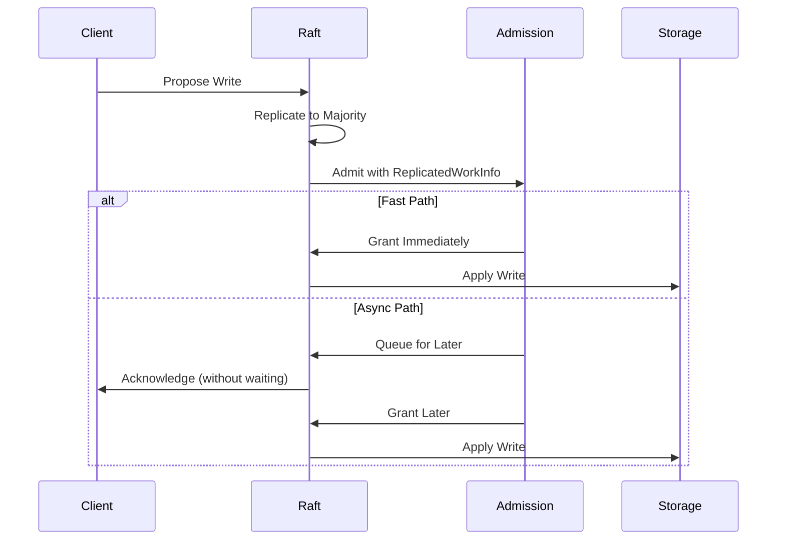

# 第章：ReplicatedWorkInfo 在准入控制中的作用

## 引言

在 CockroachDB 的准入控制系统中，`ReplicatedWorkInfo` 结构体扮演着至关重要的角色，特别是在处理复制写入（replicated writes）时。本章将深入探讨 `ReplicatedWorkInfo` 在 `WorkQueue.Admit` 函数中的具体作用，以及它如何与复制流程和准入控制机制相互作用。

## 第一节：ReplicatedWorkInfo 的数据结构

### 1.1 结构体定义

`ReplicatedWorkInfo` 是一个专门用于处理复制写入的数据结构，定义在 `pkg/util/admission/work_queue.go` 中：

```go
type ReplicatedWorkInfo struct {
    // Enabled captures whether this work represents a replicated write,
    // subject to below-raft asynchronous admission control.
    Enabled bool
    
    // RangeID identifies the raft group on behalf of which work is being
    // admitted.
    RangeID roachpb.RangeID
    
    // Replica that asked for admission.
    ReplicaID roachpb.ReplicaID
    
    // LeaderTerm is the term of the leader that asked for this entry to be
    // appended.
    LeaderTerm uint64
    
    // LogPosition is the point on the raft log where the write was replicated.
    LogPosition LogPosition
    
    // RaftPri is the raft priority of the entry. Only populated for RACv2.
    RaftPri raftpb.Priority
    
    // Ingested captures whether the write work corresponds to an ingest
    // (for sstables, for example). This is used alongside RequestedCount to
    // maintain accurate linear models for L0 growth due to ingests and
    // regular write batches.
    Ingested bool
}
```

### 1.2 关联数据结构

`LogPosition` 用于精确标识 Raft 日志中的位置：

```go
type LogPosition struct {
    Term  uint64  // Raft 任期号
    Index uint64  // 日志索引
}
```

### 1.3 字段详解

| 字段 | 类型 | 描述 |
|------|------|------|
| Enabled | bool | 标志位，表示是否启用复制写入的异步准入控制 |
| RangeID | roachpb.RangeID | 标识工作所属的 Raft 组 |
| ReplicaID | roachpb.ReplicaID | 请求准入的副本 ID |
| LeaderTerm | uint64 | 请求追加该条目的 Leader 的任期号 |
| LogPosition | LogPosition | 写入在 Raft 日志中的位置 |
| RaftPri | raftpb.Priority | Raft 条目的优先级（仅用于 RACv2）|
| Ingested | bool | 标志位，表示写入是否对应于摄入操作（如 SSTable）|

## 第二节：ReplicatedWorkInfo 在 Admit 函数中的作用

### 2.1 Admit 函数的入口逻辑

`WorkQueue.Admit` 函数是准入控制的核心入口点，其签名为：

```go
func (q *WorkQueue) Admit(ctx context.Context, info WorkInfo) (enabled bool, err error)
```

在函数的开头，首先检查 `ReplicatedWorkInfo.Enabled` 字段：

```go
if !info.ReplicatedWorkInfo.Enabled {
    // 传统的准入控制逻辑
    enabledSetting := admissionControlEnabledSettings[q.workKind]
    if enabledSetting != nil && !enabledSetting.Get(&q.settings.SV) {
        q.metrics.recordBypassedAdmission(info.Priority)
        return false, nil
    }
}
```

### 2.2 复制写入的特殊处理

当 `ReplicatedWorkInfo.Enabled` 为 true 时，表示这是一个复制写入操作，需要特殊处理：

```go
if info.ReplicatedWorkInfo.Enabled {
    if info.BypassAdmission {
        panic("unexpected BypassAdmission bit set for below raft admission")
    }
    if !q.usesTokens {
        panic("unexpected ReplicatedWrite.Enabled on slot-based queue")
    }
}
```

**关键限制**：
1. 复制写入不能绕过准入控制（`BypassAdmission` 必须为 false）
2. 复制写入只能在基于令牌的队列中使用（不能在基于槽位的队列中使用）

### 2.3 快速路径（Fast Path）

在快速路径中，如果复制写入获得准入，会触发特殊的日志记录和回调：

```go
if info.ReplicatedWorkInfo.Enabled {
    if log.V(1) {
        log.Dev.Infof(ctx, "fast-path: admitting t%d pri=%s r%s log-position=%s ingested=%t",
            tenantID, info.Priority,
            info.ReplicatedWorkInfo.RangeID,
            info.ReplicatedWorkInfo.LogPosition.String(),
            info.ReplicatedWorkInfo.Ingested,
        )
    }
    q.onAdmittedReplicatedWork.admittedReplicatedWork(
        roachpb.MustMakeTenantID(tenantID),
        info.Priority,
        info.ReplicatedWorkInfo,
        info.RequestedCount,
        info.CreateTime,
        false, /* coordMuLocked */
    )
}
```

### 2.4 异步路径（Async Path）

对于复制写入，准入控制是异步的，这意味着工作被排队后立即返回，而不需要等待实际获得准入：

```go
if info.ReplicatedWorkInfo.Enabled {
    if log.V(1) {
        q.mu.Lock()
        queueLen := tenant.waitingWorkHeap.Len()
        q.mu.Unlock()
        log.Dev.Infof(ctx, "async-path: len(waiting-work)=%d: enqueued t%d pri=%s r%s log-position=%s ingested=%t",
            queueLen, tenantID, info.Priority,
            info.ReplicatedWorkInfo.RangeID,
            info.ReplicatedWorkInfo.LogPosition.String(),
            info.ReplicatedWorkInfo.Ingested,
        )
    }
    return false, nil // return without waiting (admission is asynchronous)
}
```

## 第三节：ReplicatedWorkInfo 与复制流程的关系

### 3.1 复制写入的上下文

在 CockroachDB 中，复制写入是指通过 Raft 协议复制到多个节点的写操作。这些写入在 Raft 日志中被记录，并最终应用到状态机。

`ReplicatedWorkInfo` 主要用于 "below-raft" 准入控制，即在 Raft 共识之后、应用到存储引擎之前进行的准入控制。

### 3.2 复制流程中的准入控制

1. **Raft 共识阶段**：写入被提交到 Raft 日志，获得多数节点的确认
2. **准入控制阶段**：在应用写入之前，通过 `ReplicatedWorkInfo` 进行准入控制
3. **应用阶段**：写入被应用到存储引擎



### 3.3 复制写入的优势

1. **异步处理**：复制写入可以异步处理，不阻塞客户端请求
2. **精确控制**：通过 `LogPosition` 可以精确跟踪写入在 Raft 日志中的位置
3. **优先级管理**：通过 `RaftPri` 可以管理 Raft 条目的优先级
4. **资源隔离**：通过 `RangeID` 可以对不同 Raft 组的写入进行隔离

## 第四节：ReplicatedWorkInfo 在准入控制中的具体作用

### 4.1 资源管理

`ReplicatedWorkInfo` 使得准入控制系统可以更精细地管理复制写入的资源使用：

1. **基于令牌的控制**：复制写入使用令牌机制，而不是槽位机制
2. **动态调整**：根据系统负载动态调整可用令牌数量
3. **公平分配**：在多个 Raft 组之间公平分配资源

### 4.2 优先级调度

通过 `ReplicatedWorkInfo` 中的字段，准入控制系统可以实现更智能的优先级调度：

1. **基于 Raft 优先级**：使用 `RaftPri` 字段进行优先级调度
2. **基于日志位置**：使用 `LogPosition` 确保写入按顺序处理
3. **基于副本状态**：使用 `ReplicaID` 和 `LeaderTerm` 考虑副本状态

### 4.3 错误处理与恢复

`ReplicatedWorkInfo` 还用于错误处理和系统恢复：

1. **跟踪进度**：通过 `LogPosition` 跟踪复制进度
2. **重试机制**：在准入被拒绝时，可以重试特定的写入
3. **状态恢复**：在系统恢复时，可以恢复未完成的复制写入

## 第五节：ReplicatedWorkInfo 与 StoreWorkType 的关系

### 5.1 复制写入的工作类型

复制写入通常对应于 `StoreWorkType` 中的 `RegularStoreWorkType` 或 `ElasticStoreWorkType`，具体取决于写入的性质：

1. **用户写入**：通常对应于 `RegularStoreWorkType`
2. **批量写入**：通常对应于 `ElasticStoreWorkType`
3. **快照摄入**：对应于 `SnapshotIngestStoreWorkType`

### 5.2 资源分配策略

在 `kvStoreTokenGranter.tryGrantLocked` 中，复制写入的资源分配考虑了 `ReplicatedWorkInfo` 的字段：

```go
func (sg *kvStoreTokenGranter) tryGrantLocked(
    wt admissionpb.StoreWorkType, count int64, diskWriteTokens int64,
) bool {
    // 根据 StoreWorkType 和 ReplicatedWorkInfo 进行资源分配
    // ...
}
```

### 5.3 复制写入的特殊处理

复制写入在资源分配中有特殊处理：

1. **优先级提升**：复制写入可能获得更高的优先级
2. **资源预留**：为复制写入预留一定的资源
3. **超时处理**：复制写入有不同的超时机制

## 第六节：实践案例与性能影响

### 6.1 典型使用场景

1. **高吞吐量写入**：在高吞吐量场景下，复制写入使用异步准入控制可以显著提高性能
2. **混合工作负载**：在混合工作负载中，复制写入与其他工作类型共享资源
3. **多租户环境**：在多租户环境中，复制写入需要公平地分配资源

### 6.2 性能优化

1. **批量处理**：将多个复制写入批量处理，减少准入控制的开销
2. **优先级调整**：动态调整复制写入的优先级，适应系统负载
3. **资源预分配**：为常见的复制写入模式预分配资源

### 6.3 常见问题与解决方案

1. **准入延迟**：通过调整令牌数量和优先级解决
2. **资源竞争**：通过隔离不同 Raft 组的资源解决
3. **系统过载**：通过动态调整准入控制参数解决

## 第七节：调试与监控

### 7.1 日志与指标

`ReplicatedWorkInfo` 相关的日志和指标：

1. **日志**：
   - `fast-path: admitting`：快速路径准入日志
   - `async-path: enqueued`：异步路径排队日志

2. **指标**：
   - `admission.replicated.fastpath`：快速路径准入计数
   - `admission.replicated.async`：异步路径准入计数
   - `admission.replicated.wait`：复制写入等待时间

### 7.2 调试技巧

1. **启用详细日志**：
   ```bash
   # 启用调试日志
   cockroach start --vmodule=admission=2
   ```

2. **监控关键指标**：
   ```sql
   -- 查看复制写入的准入控制指标
   SELECT * FROM crdb_internal.admission_replicated_stats;
   ```

3. **分析性能瓶颈**：
   ```sql
   -- 分析复制写入的等待时间
   SELECT * FROM crdb_internal.admission_wait_times
   WHERE work_type = 'replicated';
   ```

## 结论

`ReplicatedWorkInfo` 在 CockroachDB 的准入控制系统中扮演着至关重要的角色，特别是在处理复制写入时。通过以下机制，它实现了高效的资源管理和优先级调度：

1. **异步处理**：允许复制写入异步处理，不阻塞客户端请求
2. **精细控制**：通过多个字段实现精细的资源控制和优先级管理
3. **系统集成**：与 Raft 协议和存储引擎紧密集成
4. **性能优化**：通过快速路径和异步路径优化性能

通过深入理解 `ReplicatedWorkInfo` 的作用和实现，我们可以更好地理解 CockroachDB 如何在分布式环境中实现高效的写入处理和资源管理。这一设计不仅提高了系统的吞吐量和稳定性，还为未来的扩展和优化提供了坚实的基础。